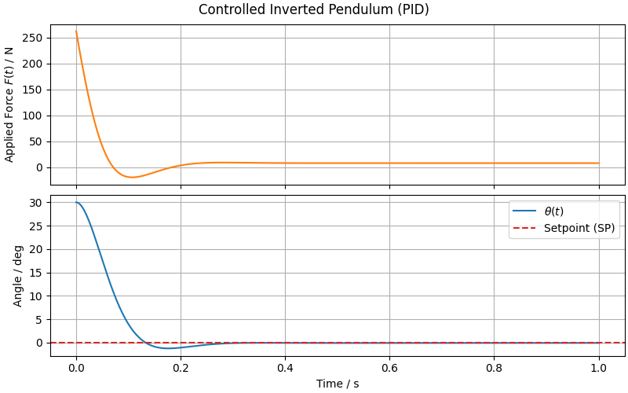

# PID Control of the Inverted Pendulum

This experiment applies a **Proportional–Integral (PID) controller** to the inverted pendulum system.
The objective is to stabilize the pendulum around the upright equilibrium:

$$\theta(t) \rightarrow 0$$

## 📎 Related Model

- [**Inverted Pendulum**](/models/mechanical/inverted-pendulum/README.md)

## 🧪 Methodology

We control the pendulum using the angle error $e(t)$:

$$e(t) = \theta_{\text{SP}} - \theta(t), \qquad \theta_{\text{SP}} = 0,$$

where $\theta_{\text{SP}}$ is the desired angle (the setpoint).

The manipulated variable is the horizontal force applied to the cart:

$$F(t) = K_p \, e(t) + K_i \int_0^t e(\tau) \, d\tau + K_d \frac{d e(t)}{dt},$$

where:

- $K_p$ is the proportional gain (reacts to the instantaneous error).
- $K_i$ is the integral gain (reacts to the accumulated past error).
- $K_d$ is the **derivative gain** (reacts to the rate of change of the error).
- $F(t)$ is the force applied to the cart.

We use the symbol $\tau$ instead of $t$ inside the integral because the integral term represents the **accumulated error over all past times**, not the current time instant.
The variable $\tau$ acts as a dummy integration variable that runs through the history from 0 to $t$, while $t$ itself remains the upper limit of integration.

### Numeric Simulation of PID Control

To solve the PID numerically, we proceed as follows:

- The **proportional term** uses the instantaneous error:

$$e(t) = \theta_{\rm SP} - \theta(t)$$

- The **derivative term** uses the rate of change of the error.
  Since the setpoint is constant, we have:

$$\dot{e}(t) = \frac{d}{dt}(\theta_{\rm SP} - \theta(t)) = - \dot{\theta}(t) = -\omega(t)$$

- The **integral term** can be computed directly by the solver by including it as a state variable:

$$\frac{d I_e}{dt} = e(t)$$

where $I_e$ is the integral of the error.

## 📊 Results and Conclusions

The PID control successfully stabilized the inverted pendulum around the setpoint angle.
It is important to note that due to the **viscous damping** of the cart, even after the pendulum angle $\theta$ has reached the setpoint, a nonzero horizontal force $F(t)$ must continue to be applied to compensate for friction and maintain the system in equilibrium. This is why the force does not drop to zero once the pendulum is upright.

Feel free to experiment with the PID parameters ($K_p$, $K_i$, and $K_d$) to see how the system responds.
You can increase or decrease each gain, observe overshoot, oscillations, or faster stabilization, and get a hands-on understanding of how proportional, integral, and derivative actions affect the pendulum's behavior.
