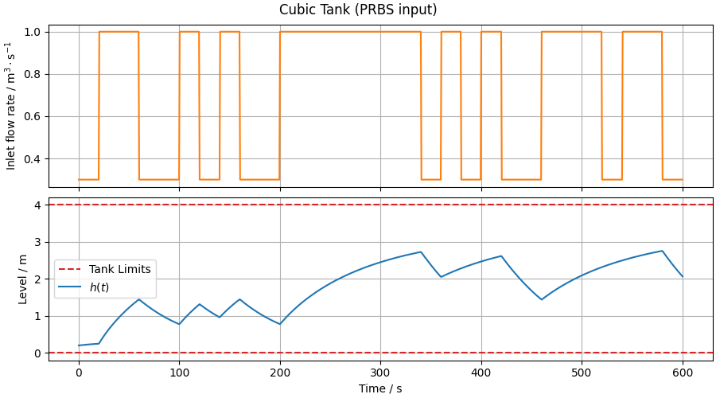

# Cubic Tank: Response to a Pseudo Random Binary Signal (PRBS)

This experiment investigates the dynamic behavior of a **cubic tank** when subjected to a **Pseudo Random Binary Signal (PRBS)** applied to the inlet flow rate.

## 📎 Related Model

- [**Cubic Tank with Gravity-Driven Outlet**](/models/tank/cubic/README.md)

## 🧪 Methodology

The experiment consists of applying a **PRBS** to the tank inlet flow while observing the resulting **liquid level** response.

The system is simulated over a fixed time horizon using a numerical solver, allowing the analysis of how the tank level responds to rapid and irregular changes in the input.

## 📊 Results and Conclusions

Under PRBS excitation, the tank **never reaches steady state**, since the input continuously changes and keeps the system persistently excited.

This excitation makes the PRBS particularly suitable for system identification, since it provides rich dynamic information across multiple operating conditions without allowing the system to settle.

Feel free to experiment with the PRBS parameters, such as the amplitude levels or the switching period, to observe how the tank response changes.
