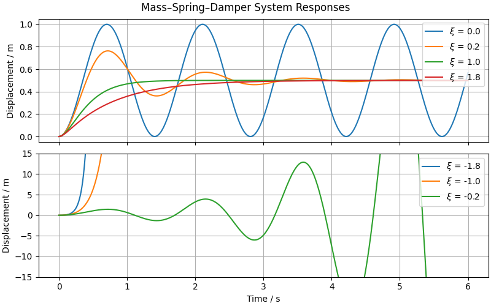

# Mass–Spring–Damper: Effect of Damping on System Response

This experiment explores how the **mass–spring–damper system** behaves under different damping conditions.

## 📎 Related Model

- [**Mass–Spring–Damper System**](/models/mechanical/mass–spring–damper/README.md)

## 🧪 Methodology

We simulate the mass–spring–damper system **four times**, varying the **damping coefficient** $c$ while keeping the other parameters constant.

The **damping ratio** $\zeta$ is a dimensionless parameter that characterizes how the system dissipates energy:

$$\zeta = \frac{c}{2 \sqrt{k m}}$$

The four chosen damping coefficients correspond to different behaviors:

1. **Undamped:** $\zeta = 0$
2. **Underdamped:** $\zeta < 1$
3. **Critically damped:** $\zeta = 1$
4. **Overdamped:** $\zeta > 1$

Each case is simulated over the same time interval using a numerical solver, allowing a direct comparison of how the system response changes with the damping.

## 📊 Results and Conclusions

The simulation shows the system response for different damping ratios under a constant external force:

- **$\zeta$ = 0**: Undamped, oscillates indefinitely around equilibrium.
- **$\zeta$ = 0.2**: Underdamped, oscillates but gradually settles.
- **$\zeta$ = 1**: Critically damped, returns to equilibrium fastest without oscillations.
- **$\zeta$ = 1.8**: Overdamped, returns to equilibrium slowly without oscillations.

These results illustrate not only how damping changes the transient response of the system, but also how the system's behavior can change **dramatically** depending on its parameters.
