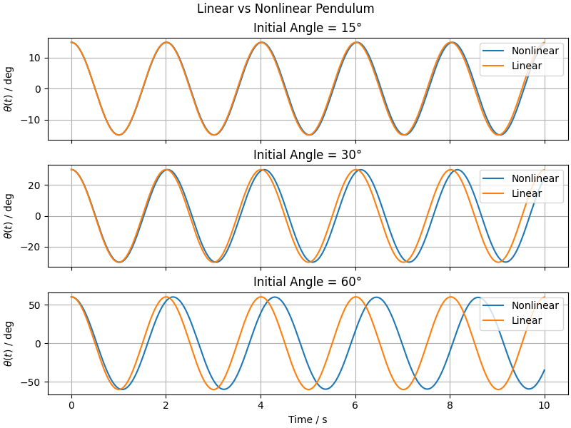

# Linear vs Nonlinear Pendulum

This experiment compares the **linear** and **nonlinear** models of the simple pendulum.
Both describe the same system, but we want to test how well the linear model approximates the true dynamics.

## 📎 Related Models

- [**Simple Pendulum**](/models/mechanical/simple-pendulum/README.md)
- [**Linear Simple Pendulum**](/models/mechanical/linear-simple-pendulum/README.md)

## 🧪 Methodology

We simulate both models under identical conditions, varying only the **initial angular displacement**. Three initial angles are tested: 15°, 30°, and 60°.

For each case, the models are integrated over the same time interval using the same numerical solver, allowing a direct comparison of their predicted trajectories.

## 📊 Results and Conclusions

As seen in the simulation results, the linear model matches the nonlinear behavior well for **small angles**, but as the initial angle increases, the trajectories **diverge significantly**, and the linear approximation becomes invalid.
