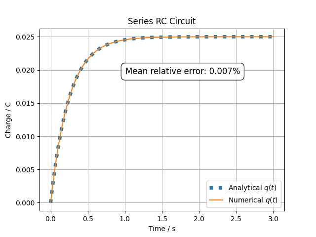

# RC Circuit: Numerical vs Analytical Solution

This experiment compares the **numerical simulation** and the **analytical solution** of a series RC circuit. We want to test how well the numerical solver approximates the analytical response.

## 📎 Related Model

- [**Series RC Circuit (Charge)**](/models/electrical/RC-circuit-series-charge/README.md)

## 🧪 Methodology

Starting from the differential equation for the charge $q(t)$ on the capacitor:

$$
\frac{dq(t)}{dt} = -\frac{q(t)}{CR} + \frac{\varepsilon(t)}{R}
$$

Applying the [Laplace transform](/docs/laplace.md) to the equation:

$$
s Q(s) - q(0) = \frac{-1}{CR} Q(s) + \frac{1}{R} \mathcal{L}\{\varepsilon(t)\}
$$

Substituting $q(0) = 0$ and assuming a constant input voltage ($\varepsilon(t) = \varepsilon$):

$$
s Q(s) = \frac{\varepsilon}{R s} - \frac{1}{CR} Q(s)
$$

Rearranging for $Q(s)$, the Laplace transform of $q(t)$:

$$
Q(s) = \frac{\varepsilon}{R s \left(s + \frac{1}{RC}\right)}
$$

Finally, applying the **inverse Laplace transform** gives the analytical solution for the capacitor charge:

$$
q(t) = \varepsilon \cdot C \cdot \left(1 - e^{-t/(RC)}\right)
$$

This solution allows us to compute the capacitor charge $q(t)$ analytically.

For comparison, we integrate the same differential equation **numerically** using a standard ODE solver under identical initial conditions, and then compute the mean relative error in percent between the numerical and analytical solutions.

## 📊 Results and Conclusions

As seen in the simulation results, the numerical solution (SciPy’s RK45) closely matches the analytical response. The solver accurately reproduces the theoretical behavior of the RC circuit.

The mean relative error between the numerical and analytical solutions is approximately 0.007%, indicating a very high accuracy of the numerical method.

Feel free to experiment with other numerical methods and solver parameters to explore how they affect the accuracy.
