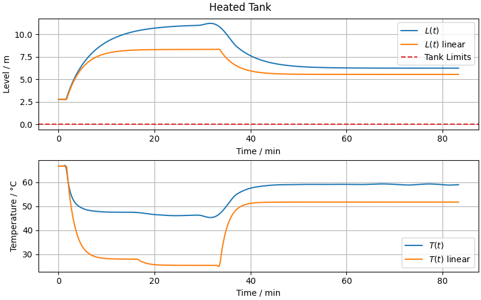

# Heated Tank System: Linearization Comparison

This experiment explores the **linearization of the heated tank system** and compares the behavior of the **original nonlinear model** with its **linear approximation**.

## 📎 Related Model

- [**Heated Tank**](/models/tank/with-heating/README.md)

## 🧪 Methodology

The process of linearizing a system involves approximating it by a linear model around a **specific point**. This allows easier analysis and control design.

### 1. Choosing the linearization point

The linearization point $(\mathbf{x}_0, \mathbf{u}_0)$ is typically chosen as a **stationary point** (steady-state) where:

$$
\dot{\mathbf{x}}(\mathbf{x}_0, \mathbf{u}_0) = \mathbf{f}(\mathbf{x}_0, \mathbf{u}_0) = \mathbf{0}
$$

For our heated tank system, the state variables $\mathbf{x}$ and input variables $\mathbf{u}$ are:

$$
\mathbf{x} =
\begin{bmatrix}
  L \\
  T
\end{bmatrix}
$$

$$
\mathbf{u} =
\begin{bmatrix}
  q_\text{in} \\
  q_j \\
  T_\text{in}
\end{bmatrix}
$$

The linearization point $(L_0, T_0, q_\text{in,0}, q_{j,0}, T_\text{in,0})$ is selected such that the system is at equilibrium, meaning the tank level and temperature remain constant.

### 2. Taylor Series Approximation

To linearize, we start by expanding the system equations using a first-order Taylor series around the linearization point $(\mathbf{x}_0, \mathbf{u}_0)$:

$$
\mathbf{f}(\mathbf{x}, \mathbf{u}) \approx \mathbf{f}(\mathbf{x}_0, \mathbf{u}_0) +
\underbrace{\frac{\partial \mathbf{f}}{\partial \mathbf{x}}\Big|_{\mathbf{x}_0, \mathbf{u}_0}}_{\mathbf{A}} (\mathbf{x} - \mathbf{x}_0) +
\underbrace{\frac{\partial \mathbf{f}}{\partial \mathbf{u}}\Big|_{\mathbf{x}_0, \mathbf{u}_0}}_{\mathbf{B}} (\mathbf{u} - \mathbf{u}_0)
$$

> For details on the Taylor series, see [Taylor Series](/docs/taylor.md).

Here:

- $\frac{\partial \mathbf{f}}{\partial \mathbf{x}}\Big|_{\mathbf{x}_0, \mathbf{u}_0} = \mathbf{A}$ is the **Jacobian matrix of the states**, size $n \times n$
- $\frac{\partial \mathbf{f}}{\partial \mathbf{u}}\Big|_{\mathbf{x}_0, \mathbf{u}_0} = \mathbf{B}$ is the **Jacobian matrix of the inputs**, size $n \times m$

### 3. Deviation Variables

A **linear system** must satisfy the **principle of superposition**, which means:

1. **Additivity**: the response to a sum of inputs equals the sum of responses
2. **Homogeneity**: scaling the input scales the output proportionally

For most nonlinear systems, even after applying the first-order Taylor series, these properties are not satisfied.

To handle this, we define **deviation variables** that measure deviations from the linearization point:

$$\bar{\mathbf{x}} = \mathbf{x} - \mathbf{x}_0$$

$$\bar{\mathbf{u}} = \mathbf{u} - \mathbf{u}_0$$

$$
\dot{\bar{\mathbf{x}}} = \dot{\mathbf{x}} - \dot{\mathbf{x}}_0
$$

As a result, the constant term in the Taylor expansion disappears:

$$
\mathbf{f}(\mathbf{x}_0, \mathbf{u}_0) = \mathbf{0},
$$

and the first-order approximation simplifies to a linear system:

$$
\dot{\bar{\mathbf{x}}} =
\mathbf{A} \bar{\mathbf{x}} + \mathbf{B} \bar{\mathbf{u}}
$$

In practice, we simulate the system using deviation variables and then convert back to the original engineering variables.

## 📊 Results and Conclusions

As seen in the simulation:

- For **small deviations** around the operating point, the linearized model **closely matches** the nonlinear behavior.
- For **larger deviations**, the linear model diverges from the nonlinear system, highlighting the limits of the linear approximation.

This experiment illustrates how linearization can simplify analysis and control design, while also emphasizing that it is only valid **near the chosen operating point**.
