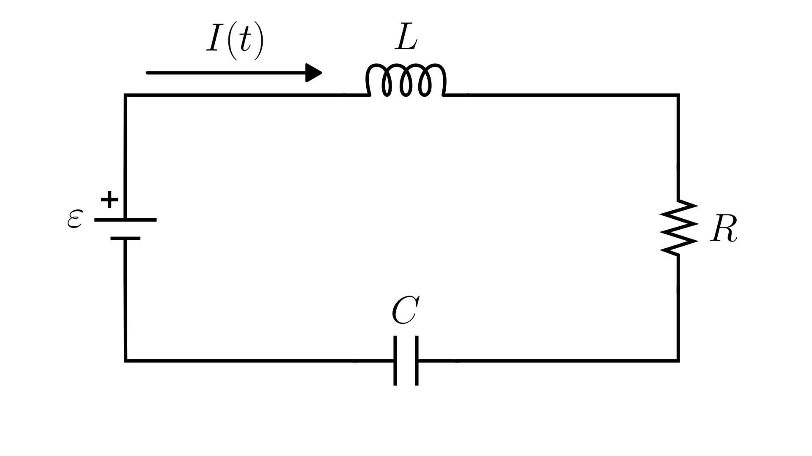

# Series RLC Circuit (Charge)

> This model follows the general assumptions of **electronic circuit models**.
> For details, see [Electrical Circuits](/models/circuits/README.md).

This section describes a simple electrical circuit composed of a **voltage source**, a **resistor**, an **inductor**, and a **capacitor** connected in series.
The physical system is illustrated in the figure below:

The dynamics of the circuit are described in terms of the charge $q(t)$ of the capacitor:

$$
\frac{d^2q(t)}{dt^2} = \frac{1}{L}\varepsilon(t) - \frac{R}{L}\frac{dq(t)}{dt} - \frac{1}{LC}q(t)
$$

Where:

- $\varepsilon(t)$: applied voltage [V]
- $q(t)$: charge on the capacitor [C]
- $R$: resistance [Ω]
- $L$: inductance [H]
- $C$: capacitance [F]

> Note: This is a **second-order ODE**, so some numerical solvers may require reducing it to a system of first-order equations.
> For details on how to do this, see [Reducing Higher-Order ODEs](/docs/ode_reduction.md).

## Model Classification

| Property                                 | Classification      |
| ---------------------------------------- | ------------------- |
| Static × Dynamic                         | **Dynamic**         |
| Linear × Nonlinear                       | **Linear**          |
| SISO × SIMO × MISO × MIMO                | **SISO**            |
| Continuous-time × Discrete-time          | **Continuous-time** |
| Time-invariant × Time-variant            | **Time-invariant**  |
| Lumped-parameters × Distributed-elements | **Lumped**          |
| Deterministic × Stochastic               | **Deterministic**   |

## Model Derivation

1. Applying [Kirchhoff’s Voltage Law](/docs/kirchhoff-laws.md) to the loop:

   $`\varepsilon(t) - V_R(t) - V_L(t) - V_C(t) = 0,`$

   where $V_R(t)$, $V_L(t)$, and $V_C(t)$ are the voltage drops across the resistor, inductor, and capacitor, respectively.

2. Applying the [constitutive equations](/docs/electronic-components.md) of the components:

   $`\varepsilon(t) - R I(t) - L \frac{dI(t)}{dt} - \frac{1}{C} q(t) = 0,`$

   where $I(t)$ is the current through the circuit.

3. By definition, the current in the circuit is the time derivative of charge:
   $`I(t) = \frac{dq(t)}{dt}`$

   Substituting into the loop equation:

   $`\varepsilon(t) - R \frac{dq(t)}{dt} - L \frac{d^2q(t)}{dt^2} - \frac{1}{C} q(t) = 0`$

4. Solving for the second derivative of the charge:

   $`\boxed{\frac{d^2q(t)}{dt^2} = \frac{1}{L}\varepsilon(t) - \frac{R}{L}\frac{dq(t)}{dt} - \frac{1}{LC}q(t)}`$
