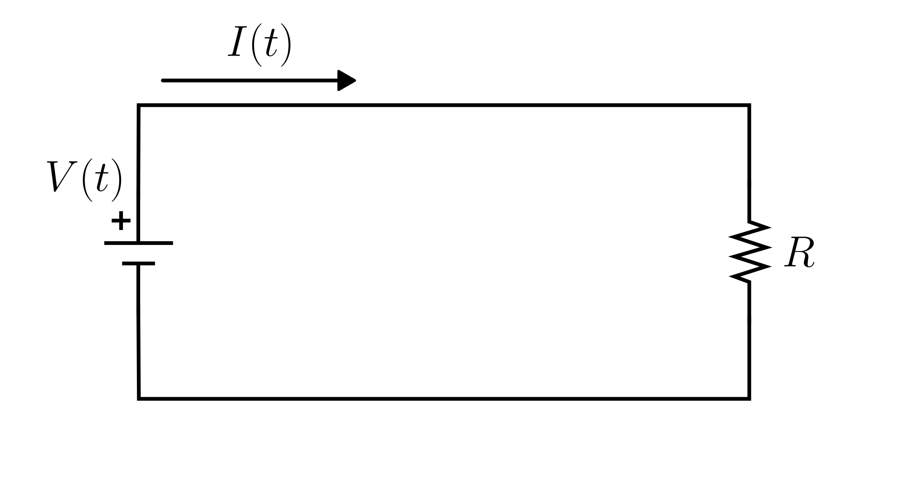

# Resistor Circuit

> This model follows the general assumptions of **electronic circuit models**.
> For details, see [Electrical Circuits](/models/electrical/README.md).

This section describes a simple **electrical circuit** composed of a **voltage source** and a **resistor** connected in series.
The current through the resistor is determined directly by **Ohm’s Law**, making this a purely algebraic model.

The physical system is illustrated in the figure below:

The governing equation is:

$$
I(t) = \frac{V(t)}{R}
$$

Where:

- $I(t)$: current through the resistor [A]
- $V(t)$: applied voltage [V]
- $R$: resistance [Ω]

## Model Classification

> While this model is classified as **Static**, real physical resistor circuits exhibit dynamic behavior due to wire inductance, parasitic capacitance, and other non-ideal effects.
> However, these dynamics occur on extremely fast time scales, making this model an excellent approximation for most practical purposes.

| Property                                 | Classification      |
| ---------------------------------------- | ------------------- |
| Static × Dynamic                         | **Static**          |
| Linear × Nonlinear                       | **Linear**          |
| SISO × SIMO × MISO × MIMO                | **SISO**            |
| Continuous-time × Discrete-time          | **Continuous-time** |
| Time-invariant × Time-variant            | **Time-invariant**  |
| Lumped-parameters × Distributed-elements | **Lumped**          |
| Deterministic × Stochastic               | **Deterministic**   |

## Model Derivation

1. Applying [Kirchhoff’s Voltage Law](/docs/kirchhoff-laws.md) to the loop:

   $`V(t) - V_R(t) = 0`$

   where $V(t)$ is the source voltage and $V_R(t)$ is the resistor voltage.

2. Applying the [constitutive equation of the resistor](/docs/electronic-components.md):

   $`V(t) - R \cdot I(t) = 0`$

   $`V(t) = R \cdot I(t)`$

3. Solving for the current:

   $`\boxed{I(t) = \frac{V(t)}{R}}`$
