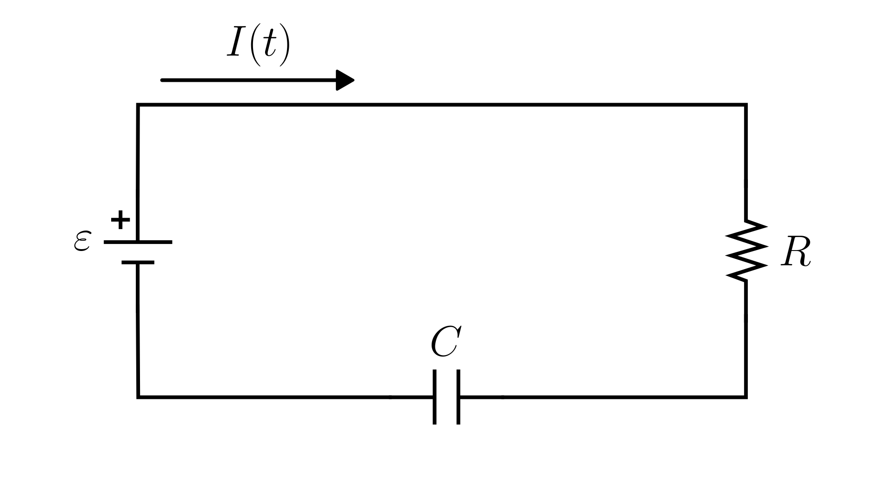

# Series RC Circuit (Charge)

> This model follows the general assumptions of **electronic circuit models**.
> For details, see [Electrical Circuits](/models/electrical/README.md).

This section describes a simple **electrical circuit** composed of a **voltage source**, a **resistor**, and a **capacitor** connected in series.

The physical system is illustrated in the figure below:

The dynamics of the circuit are described in terms of the charge $q(t)$ of the capacitor:

$$
\frac{dq(t)}{dt} = -\frac{q(t)}{CR} + \frac{\varepsilon(t)}{R}
$$

Where:

- $\varepsilon(t)$: applied voltage [V]
- $q(t)$: charge on the capacitor [C]
- $R$: resistance [Ω]
- $C$: capacitance [F]

## Model Classification

| Property                                 | Classification      |
| ---------------------------------------- | ------------------- |
| Static × Dynamic                         | **Dynamic**         |
| Linear × Nonlinear                       | **Linear**          |
| SISO × SIMO × MISO × MIMO                | **SISO**            |
| Continuous-time × Discrete-time          | **Continuous-time** |
| Time-invariant × Time-variant            | **Time-invariant**  |
| Lumped-parameters × Distributed-elements | **Lumped**          |
| Deterministic × Stochastic               | **Deterministic**   |
| Forced × Homogeneous                     | **Forced**          |

## Model Derivation

1. Applying [Kirchhoff’s Voltage Law](/docs/kirchhoff-laws.md) to the loop:

   $`\varepsilon(t) - V_R(t) - V_C(t) = 0,`$

   where $V_R(t)$ is the voltage drop across the resistor and $V_C(t)$ is the voltage drop across the capacitor.

2. Applying the [constitutive equations of the components](/docs/electronic-components.md):

   $`\varepsilon(t) - R \cdot I(t) - \frac{1}{C} q(t) = 0,`$

   where $I(t)$ is the current through the circuit.

3. By the definition of electric current, the current in the circuit is the time derivative of charge. Substituting $I(t) = \frac{dq(t)}{dt}$ into the loop equation:

   $`\varepsilon(t) - R \frac{dq(t)}{dt} - \frac{1}{C} q(t) = 0`$

4. Solving for the derivative of the charge:

   $`\boxed{\frac{dq(t)}{dt}= -\frac{q(t)}{CR} + \frac{\varepsilon(t)}{R}}`$
