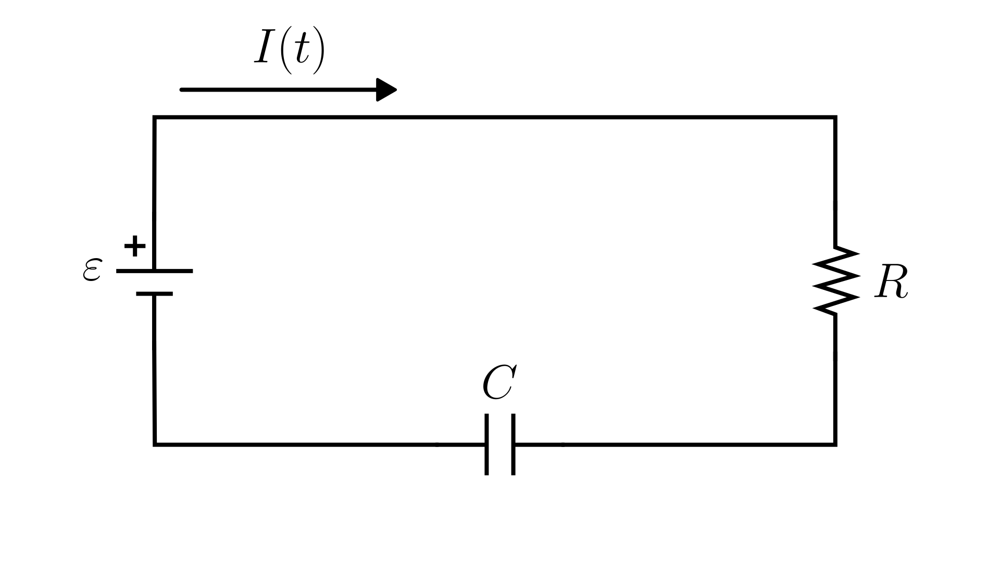

# Series RC Circuit (Voltage)

> This model follows the general assumptions of **electronic circuit models**.
> For details, see [Electrical Circuits](/models/circuits/README.md).

This section describes a simple **electrical circuit** composed of a **voltage source**, a **resistor**, and a **capacitor** connected in series.

The physical system is illustrated in the figure below:

The dynamics of the circuit are described in terms of the capacitor voltage $V_C(t)$:

$$
\frac{dV_C(t)}{dt} = \frac{1}{RC} \big( \varepsilon(t) - V_C(t) \big)
$$

Where:

- $\varepsilon(t)$: applied voltage [V]
- $V_C(t)$: voltage across the capacitor [V]
- $R$: resistance [Ω]
- $C$: capacitance [F]

## Model Classification

| Property                                 | Classification      |
| ---------------------------------------- | ------------------- |
| Static × Dynamic                         | **Dynamic**         |
| Linear × Nonlinear                       | **Linear**          |
| SISO × SIMO × MISO × MIMO                | **SISO**            |
| Continuous-time × Discrete-time          | **Continuous-time** |
| Time-invariant × Time-variant            | **Time-invariant**  |
| Lumped-parameters × Distributed-elements | **Lumped**          |
| Deterministic × Stochastic               | **Deterministic**   |

## Model Derivation

1. Applying [Kirchhoff’s Voltage Law](/docs/kirchhoff-laws.md) to the loop:

   $`\varepsilon(t) - V_R(t) - V_C(t) = 0,`$

   where $V_R(t)$ is the voltage drop across the resistor and $V_C(t)$ is the voltage drop across the capacitor.

2. Applying the only the [constitutive equation](/docs/electronic-components.md) of the resistor:

   $`\varepsilon(t) - R \cdot I(t) - V_C(t) = 0,`$

   where $I(t)$ is the current through the circuit.

3. By the **definition of electric current**, the current is the time derivative of charge:

   $`I(t) = \frac{dq(t)}{dt}`$

   For a capacitor, the charge is related to the voltage by $q(t) = C V_C(t)$.
   Substituting into the definition of current:

   $`I(t) = \frac{d}{dt}[C V_C(t)] = C \frac{dV_C(t)}{dt}`$

4. Substituting this expression for $I(t)$ into the loop equation:

   $`\varepsilon(t) - R C \frac{dV_C(t)}{dt} - V_C(t) = 0`$

5. Rearranging for the capacitor voltage dynamics:

   $\boxed{\frac{dV_C(t)}{dt} = \frac{1}{RC} \big( \varepsilon(t) - V_C(t) \big)}$
