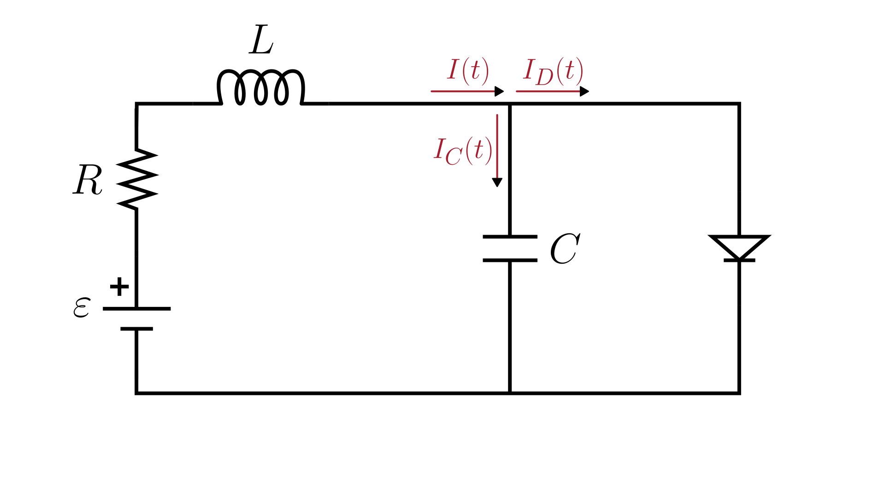

# Series RLC Circuit with Parallel Diode (Shockley diode equation)

> This model follows the general assumptions of **electronic circuit models**.
> For details, see [Electrical Circuits](/models/electrical/README.md).

This section describes a series RLC circuit with a **voltage source**, **resistor**, **inductor**, and **capacitor**, where the capacitor is connected in **parallel with a diode**.
The physical system is illustrated in the figure below:

The dynamics of the circuit are described in terms of the **voltage across the capacitor** $V_C(t)$ and the **current through the circuit** $I(t)$:

$$
\begin{cases}
  \displaystyle \frac{dV_C(t)}{dt} = \frac{1}{C} \left( I(t) - I_D(V_C) \right)\\
  \displaystyle \frac{dI(t)}{dt} = \frac{1}{L} \left( \varepsilon(t) - R I(t) - V_C(t) \right)
\end{cases}
$$

Where:

- $\varepsilon(t)$: applied voltage [V]
- $V_C(t)$: voltage across the capacitor [V]
- $I(t)$: current through the voltage source [A]
- $I_D(V_C)$: current through the diode [A]
- $R$: resistance [Ω]
- $L$: inductance [H]
- $C$: capacitance [F]

The diode current $I_D$ is modeled using the **Shockley diode equation**. For detailed information about the Shockley diode model and its parameters, see the [Circuit Components](/docs/electronic-components.md) documentation.

**Important note:** Due to the parallel connection in the circuit, the voltage across the capacitor $V_C(t)$ and the voltage across the diode $V_D(t)$ are equal at all times. Therefore, the Shockley equation uses $V_C$ directly as the diode voltage in the expression $I_D(V_C)$.

## Model Classification

| Property                                 | Classification      |
| ---------------------------------------- | ------------------- |
| Static × Dynamic                         | **Dynamic**         |
| Linear × Nonlinear                       | **Nonlinear**       |
| SISO × SIMO × MISO × MIMO                | **SIMO**            |
| Continuous-time × Discrete-time          | **Continuous-time** |
| Time-invariant × Time-variant            | **Time-invariant**  |
| Lumped-parameters × Distributed-elements | **Lumped**          |
| Deterministic × Stochastic               | **Deterministic**   |
| Forced × Homogeneous                     | **Forced**          |

## Model Derivation

1. Applying [Kirchhoff’s Voltage Law](/docs/kirchhoff-laws.md) to the main loop:

   $`\varepsilon(t) - V_R(t) - V_L(t) - V_C(t) = 0`$

2. Applying the [constitutive equations](/docs/electronic-components.md) of the components:

   $`\varepsilon(t) - R I(t) - L \frac{dI(t)}{dt} - V_C(t) = 0`$

3. Applying [Kirchhoff’s Current Law](/docs/kirchhoff-laws.md) at the capacitor-diode node:

   $`I(t) = I_C(t) + I_D(t)`$

4. The voltage across a capacitor is related to the stored charge by:

   $`V_C(t) = \frac{q(t)}{C}`$

   Differentiating both sides with respect to time:

   $`\frac{dV_C(t)}{dt} = \frac{1}{C} \frac{dq(t)}{dt}`$

   Recognizing that $\frac{dq(t)}{dt} = I_C(t)$ (the current through the capacitor), we obtain the fundamental capacitor equation:

   $`I_C(t) = C \frac{dV_C(t)}{dt}`$

   Substituting this relation into the KCL equation from step 3:

   $`I(t) = C \frac{dV_C(t)}{dt} + I_D(t)`$

5. Joining the KVL and the KCL in a system of first-order differential equations:

   $`\begin{cases}
      I(t) = C \frac{dV_C(t)}{dt} + I_D(t)\\
      \varepsilon(t) - R I(t) - L \frac{dI(t)}{dt} - V_C(t) = 0
   \end{cases}`$

   Rearranging:

   $`\boxed{
      \begin{cases}
         \frac{dV_C(t)}{dt} = \frac{1}{C} \left( I(t) - I_D(V_C) \right)\\
         \frac{dI(t)}{dt} = \frac{1}{L} \left( \varepsilon(t) - R I(t) - V_C(t) \right)
      \end{cases}
   }`$
