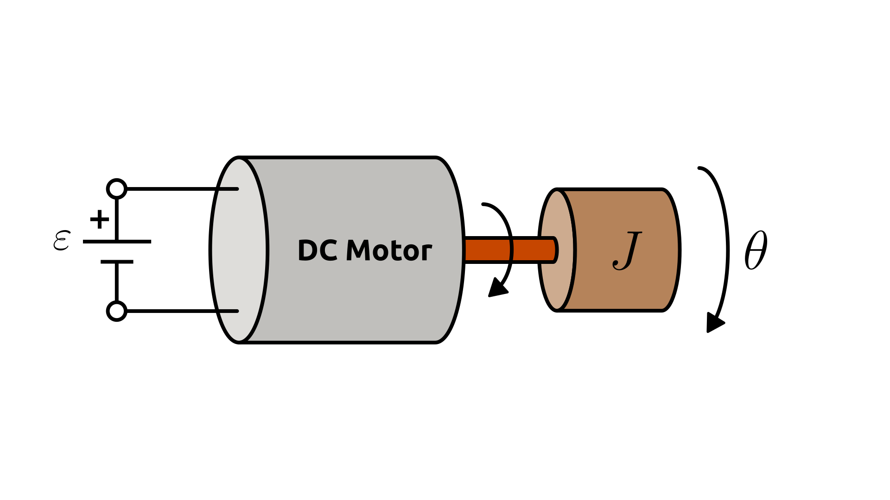

# DC Motor

This section describes a simplified **DC motor model**, which converts **electrical energy** into **mechanical rotation**.

The physical system is illustrated in the figure below:

The dynamics of the system are described in terms of the rotor angular position $\theta(t)$:

$$
J \frac{d^2 \theta(t)}{dt^2} = \frac{K_1}{R} \varepsilon(t) - \left(\frac{K_1 K_2}{R} + b\right) \frac{d\theta(t)}{dt}
$$

Where:

- $\theta(t)$: angular position of the rotor [rad]
- $\varepsilon(t)$: applied voltage [V]
- $J$: total moment of inertia seen by the motor shaft [kg·m²]
- $R$: armature resistance [Ω]
- $b$: viscous friction coefficient [N·m·s/rad]
- $K_1$: torque constant [N·m/A]
- $K_2$: back-emf constant [V·s/rad]

> Note: This model contains one or more **second-order ODEs**.
> Most numerical solvers require the system to be expressed as first-order equations.
> For details on how to do this, see [Reducing Higher-Order ODEs](/docs/ode-reduction.md).

## Model Assumptions

This system is an **electromechanical system**, meaning it involves both **electrical** and **mechanical** domains working together.

This model builds on the general assumptions of both **mechanical system models** and **electrical system models**.
For details on the general assumptions, see:

- [Mechanical Systems](/models/mechanical/README.md)
- [Electrical Systems](/models/electrical/README.md)

In addition, for the **DC motor system**, we assume:

- The magnetic flux produced by the field winding is constant.
- The armature circuit follows a linear ohmic behavior and negligible inductance.
- Viscous friction losses in the rotor and bearings are proportional to angular speed, represented by a damping coefficient $b$.
- Temperature variations, magnetic saturation, and other nonlinear effects are neglected.

## Model Classification

| Property                                 | Classification      |
| ---------------------------------------- | ------------------- |
| Static × Dynamic                         | **Dynamic**         |
| Linear × Nonlinear                       | **Linear**          |
| SISO × SIMO × MISO × MIMO                | **SISO**            |
| Continuous-time × Discrete-time          | **Continuous-time** |
| Time-invariant × Time-variant            | **Time-invariant**  |
| Lumped-parameters × Distributed-elements | **Lumped**          |
| Deterministic × Stochastic               | **Deterministic**   |
| Forced × Homogeneous                     | **Forced**          |

## Model Derivation

1. Applying [Kirchhoff’s Voltage Law](/docs/kirchhoff-laws.md) to the loop:

   The voltage applied to the armature is divided between the resistive and back-emf components:

   $`\varepsilon(t) = V_{emf}(t) + V_R(t)`$

2. Applying the [constitutive equations](/docs/electronic-components.md) of the components:

   $`\varepsilon(t) = R \cdot I(t) + K_2 \cdot \omega(t)`$

   where:

   - $I(t)$ is the armature current [A]
   - $`\omega(t) = \frac{d\theta(t)}{dt}`$ is the angular velocity [rad/s]

   Solving for $I(t)$:

   $`I(t) = \frac{1}{R}\left(\varepsilon(t) - K_2 \omega(t)\right)`$

3. Applying [Newton’s Second Law](/docs/newton-laws.md) for rotation:

   $`J \frac{d^2 \theta(t)}{dt^2} = \tau_R(t),`$

   where $\tau_R(t)$ is the resultant torque on the rotor. It is the difference between the **generated torque** $\tau_g(t)$ and the **friction torque** $`\tau_f(t)`$:

   $`\tau_R(t) = \tau_g(t) - \tau_f(t)`$

   The torque generated by the motor is proportional to the armature current:

   $`\tau_g(t) = K_1 \cdot I(t)`$

   And the friction torque is proportional to angular velocity (viscous friction):

   $`\tau_f(t) = b \cdot \omega(t)`$

   Substituting these into Newton’s law:

   $`J \frac{d^2 \theta(t)}{dt^2} = K_1 \cdot I(t) - b \cdot \omega(t)`$

4. Substituting $I(t)$ into the torque equation:

   $`J \frac{d^2 \theta(t)}{dt^2} = K_1 \left(\frac{\varepsilon(t) - K_2 \omega(t)}{R}\right) - b \omega(t)`$

5. Rearranging the Equation

   $`\boxed{
   J \frac{d^2 \theta(t)}{dt^2} = \frac{K_1}{R} \varepsilon(t) - \left(\frac{K_1 K_2}{R} + b\right) \frac{d\theta(t)}{dt}
     }`$
