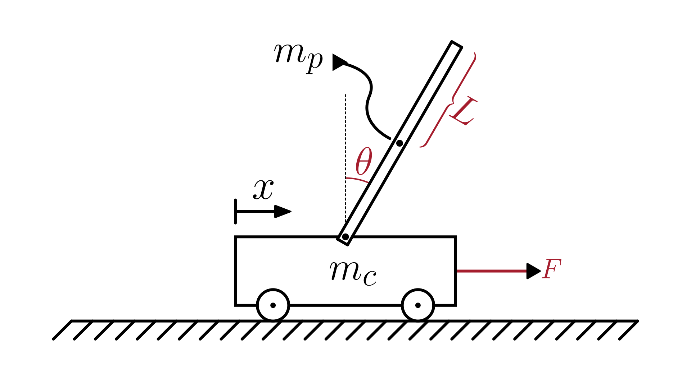

# Inverted Pendulum System

This section describes a **nonlinear mechanical system** composed of a **cart** of mass $m_c$, a **pendulum** of mass $m_p$ and length $L$, and an **external force** $F$ applied to the cart. The pendulum is free to rotate around its pivot, forming an **inverted pendulum** configuration.

The physical system is illustrated in the figure below:

The dynamics of the system are described in terms of **pendulum angle** $\theta(t)$ and **cart position** $x(t)$:

$$
\begin{cases}
  \displaystyle (m_p L^2 + J) \ddot{\theta} + m_p L \cos(\theta) \ddot{x} - m_p g L \sin(\theta) = 0 \\
  \displaystyle (m_c + m_p) \ddot{x} + m_p L \cos(\theta) \ddot{\theta} - m_p L \dot{\theta}^2 \sin(\theta) = F - b \dot{x}
\end{cases}
$$

Where:

- $\theta(t)$: pendulum angle [rad]
- $x(t)$: cart position [m]
- $m_c$: cart mass [kg]
- $m_p$: pendulum mass [kg]
- $L$: distance from pivot to pendulum rod center of mass [m]
- $b$: cart damping coefficient [N·s/m]
- $g$: gravitational acceleration [m/s²]
- $J$: Moment of inertia of the pendulum rod about its center of mass [kg·m²]
- $F(t)$: external force applied to the cart [N]

> Note: This model contains one or more **second-order ODEs**.
> Most numerical solvers require the system to be expressed as first-order equations.
> For details on how to do this, see [Reducing Higher-Order ODEs](/docs/ode-reduction.md).

> Note: In this system, some or all derivatives are not easily separable as explicit functions of the state variables.
> This can be a challenge for numerical solvers that require derivatives to be explicitly defined.
> For a detailed discussion and recommended solution approaches, see [Solving Systems with Implicit Derivatives](/docs/implicit-derivatives.md).

## Model Assumptions

This model builds on the general assumptions of **mechanical system models**.
For details on the general assumptions, see [Mechanical Systems](/models/mechanical/README.md).

In addition, for the inverted pendulum system, we assume:

- The cart moves on a frictionless, horizontal surface, except for viscous damping represented by $b$.
- The pendulum is a rigid rod with uniform mass distribution along its length.
- The pivot connecting the pendulum to the cart is frictionless.
- The pendulum moves in a vertical plane, while the cart moves horizontally.

## Model Classification

| Property                                 | Classification      |
| ---------------------------------------- | ------------------- |
| Static × Dynamic                         | **Dynamic**         |
| Linear × Nonlinear                       | **Nonlinear**       |
| SISO × SIMO × MISO × MIMO                | **SIMO**            |
| Continuous-time × Discrete-time          | **Continuous-time** |
| Time-invariant × Time-variant            | **Time-invariant**  |
| Lumped-parameters × Distributed-elements | **Lumped**          |
| Deterministic × Stochastic               | **Deterministic**   |

## Model Derivation

We will derive the equation of motion using **Lagrangian mechanics**.
For an introduction to this method, see [Lagrangian Mechanics](/docs/lagrangian-mechanics.md).

1. Define the coordinates of the pendulum mass

   We choose the generalized coordinates:

   - $x(t)$: horizontal displacement of the cart from an inertial reference point.
   - $\theta(t)$: pendulum angle, with the convention that $\theta = 0$ corresponds to the **upright** (unstable) equilibrium.

   The pendulum is modeled as a rigid rod of mass $m_p$, with its center of mass located at a distance $L$ from the pivot point.
   The pivot itself moves horizontally with the cart, so its instantaneous position is: $(x,\, 0)$

   From the pivot, the position of the pendulum’s center of mass in the inertial frame is given by:

   $`x_p = x + L \cdot \sin(\theta)`$

   $`y_p = L \cdot \cos(\theta)`$

2. Compute the velocity components

   Differentiating with respect to time gives the velocity components:

   $`\dot{x}_p = \dot{x} + L \cos(\theta) \cdot \dot{\theta}`$

   $`\dot{y}_p = -L \sin(\theta) \cdot \dot{\theta}`$

3. Compute kinetic and potential energies

   > For more details about kinetic and potential energy, see [Energy](/docs/energy.md).

   - Pendulum kinetic energy (translational + rotational about center of mass):
     $`T_p = \frac{1}{2} m_p (\dot{x}_p^2 + \dot{y}_p^2) + \frac{1}{2} J \dot{\theta}^2`$

   - Cart kinetic energy:
     $`T_c = \frac{1}{2} m_c \dot{x}^2`$

   - Total kinetic energy:
     $`T = T_c + T_p`$

   - Pendulum potential energy:
     $`V = m_p g L \cos(\theta)`$

4. Form the Lagrangian

   $`L = T - V`$

   Substituting the kinetic and potential energies:

   $`L = \frac{1}{2} m_c \dot{x}^2 + \frac{1}{2} m_p \left[(\dot{x} + L \cos(\theta) \dot{\theta})^2 + (- L \sin(\theta) \dot{\theta})^2 \right] + \frac{1}{2} J \dot{\theta}^2 - m_p g L \cos(\theta)`$

   Simplifying the pendulum kinetic energy:

   $`L = \frac{1}{2} (m_c + m_p) \dot{x}^2 + m_p L \cos(\theta) \dot{x} \dot{\theta} + \frac{1}{2} (m_p L^2 + J) \dot{\theta}^2 - m_p g L \cos(\theta)`$

5. Apply the Lagrange’s equation of motion for the pendulum angle $\theta$

   For the generalized coordinate $\theta$, the Euler–Lagrange equation reads:

   $`\frac{d}{dt} \left( \frac{\partial L}{\partial \dot{\theta}} \right) - \frac{\partial L}{\partial \theta} = Q_\theta`$

   where $`Q_\theta = 0`$.

   Compute derivatives:

   $`\frac{\partial L}{\partial \dot{\theta}} = m_p L \cos(\theta) \dot{x} + (m_p L^2 + J) \dot{\theta}`$

   $`\frac{d}{dt} \left( \frac{\partial L}{\partial \dot{\theta}} \right) = (m_p L^2 + J) \ddot{\theta} + m_p L \cos(\theta) \ddot{x} - m_p L \dot{\theta} \dot{x} \sin(\theta)`$

   $`\frac{\partial L}{\partial \theta} = - m_p L \dot{x} \dot{\theta} \sin(\theta) + m_p g L \sin(\theta)`$

   Substituting into the Euler–Lagrange equation gives:

   $`(m_p L^2 + J) \ddot{\theta} + m_p L \cos(\theta) \ddot{x} - m_p g L \sin(\theta) = 0`$

6. Apply the Euler–Lagrange equation for the cart position $x$

   For the generalized coordinate $x$, the Euler–Lagrange equation reads:

   $`\frac{d}{dt} \left( \frac{\partial L}{\partial \dot{x}} \right) - \frac{\partial L}{\partial x} = Q_x`$

   where the generalized force is $`Q_x = F - b \dot{x}`$.

   For the other terms of the equation:

   $`\frac{\partial L}{\partial \dot{x}} = (m_c + m_p) \dot{x} + m_p L \cos(\theta) \dot{\theta}`$

   $`\frac{d}{dt} \left( \frac{\partial L}{\partial \dot{x}} \right) = (m_c + m_p) \ddot{x} + m_p L \cos(\theta) \ddot{\theta} - m_p L \dot{\theta}^2 \sin(\theta)`$

   $`\frac{\partial L}{\partial x} = 0`$

   Euler–Lagrange equation for $x$:

   $`(m_c + m_p) \ddot{x} + m_p L \cos(\theta) \ddot{\theta} - m_p L \dot{\theta}^2 \sin(\theta) = F - b \dot{x}`$

7. Obtain the equations of motion

   Substituting the results from the Euler–Lagrange equations for both $\theta$ and $x$, we obtain the coupled nonlinear equations that fully describe the dynamics of the inverted pendulum on a cart:

   $`\boxed{
   \begin{cases}
   \displaystyle (m_p L^2 + J) \ddot{\theta} + m_p L \cos(\theta) \ddot{x} - m_p g L \sin(\theta) = 0 \\
   \displaystyle (m_c + m_p) \ddot{x} + m_p L \cos(\theta) \ddot{\theta} - m_p L \dot{\theta}^2 \sin(\theta) = F - b \dot{x}
   \end{cases}
   }`$
