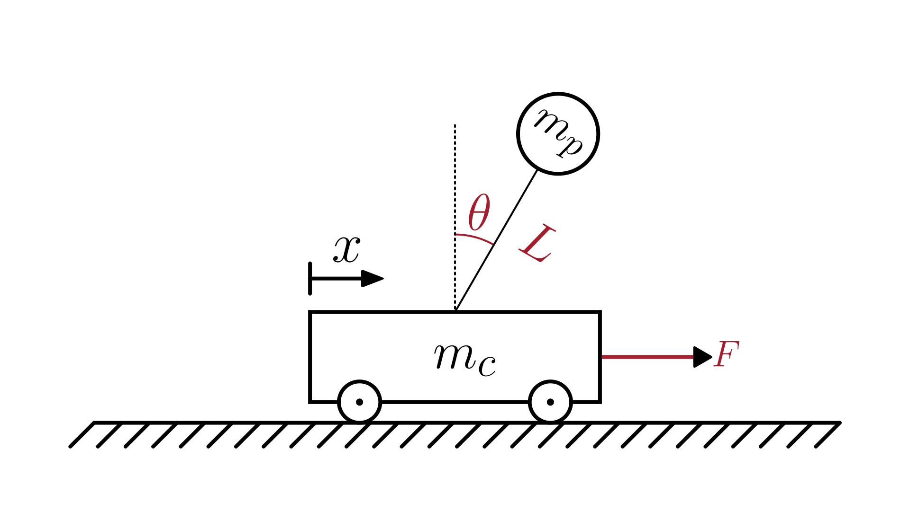

# Inverted Pendulum System (linear)

This section describes a **mechanical system** composed of a **cart** of mass $m_c$, a **pendulum** of mass $m_p$ and length $L$, and an **external force** $F$ applied to the cart.
The pendulum is free to rotate around its pivot, forming an **inverted pendulum** configuration.

The physical system is illustrated in the figure below:

The dynamics of the system are described in terms of **pendulum angle** $\theta(t)$ and **cart position** $x(t)$:

$$
\begin{cases}
  m_p L^2 \ddot{\theta} + m_p L \ddot{x} - m_p g L \theta = 0 \\
  (m_c + m_p)\ddot{x} + m_p L \ddot{\theta} = F
\end{cases}
$$

Where:

- $\theta(t)$: pendulum angle [rad]
- $x(t)$: cart position [m]
- $m_c$: cart mass [kg]
- $m_p$: pendulum mass [kg]
- $L$: distance from the pivot to the center of mass (pendulum length) [m]
- $g$: gravitational acceleration [m/s²]
- $F(t)$: external force applied to the cart [N]

> Note: This model contains one or more **second-order ODEs**.
> Most numerical solvers require the system to be expressed as first-order equations.
> For details on how to do this, see [Reducing Higher-Order ODEs](/docs/ode-reduction.md).

> Note: In this system, some or all derivatives are not easily separable as explicit functions of the state variables.
> This can be a challenge for numerical solvers that require derivatives to be explicitly defined.
> For a detailed discussion and recommended solution approaches, see [Solving Systems with Implicit Derivatives](/docs/implicit-derivatives.md).

## Model Assumptions

This model builds on the general assumptions of **mechanical system models**.
For details on the general assumptions, see [Mechanical Systems](/models/mechanical/README.md).

In addition, we assumed:

- small angular displacements ($|\theta| \ll 1   \text{rad}$), allowing linear approximations.
- The rod is **thin and rigid**, with negligible mass compared to the point mass.
- The pendulum mass is **concentrated** at the end of the rod.
- The pivot point is fixed and frictionless.
- The motion occurs in a vertical plane under the influence of gravity only.
- Small rotational inertia of the rod is ignored.

## Model Classification

| Property                                 | Classification      |
| ---------------------------------------- | ------------------- |
| Static × Dynamic                         | **Dynamic**         |
| Linear × Nonlinear                       | **Linear**          |
| SISO × SIMO × MISO × MIMO                | **SIMO**            |
| Continuous-time × Discrete-time          | **Continuous-time** |
| Time-invariant × Time-variant            | **Time-invariant**  |
| Lumped-parameters × Distributed-elements | **Lumped**          |
| Deterministic × Stochastic               | **Deterministic**   |
| Forced × Homogeneous                     | **Forced**          |

## Model Derivation

We will derive the equation of motion using **Lagrangian mechanics**.
For an introduction to this method, see [Lagrangian Mechanics](/docs/lagrangian-mechanics.md).

1. Define the coordinates of the pendulum mass

   We choose the generalized coordinates:

   - $x(t)$: horizontal displacement of the cart from an inertial reference point.
   - $\theta(t)$: pendulum angle, with the convention that $\theta = 0$ corresponds to the **upright** (unstable) equilibrium.

   The pendulum mass $m_p$ is concentrated at a distance $L$ from the pivot.
   The pivot itself moves horizontally with the cart, so its instantaneous position is: $(x,  0)$.

   From the pivot, the position of the pendulum’s center of mass in the inertial frame is given by:

   $`x_p = x + L \cdot \sin(\theta)`$

   $`y_p = L \cdot \cos(\theta)`$

2. Compute the velocity components

   Differentiating with respect to time gives the velocity components:

   $`\dot{x}_p = \dot{x} + L \cos(\theta) \cdot \dot{\theta}`$

   $`\dot{y}_p = -L \sin(\theta) \cdot \dot{\theta}`$

3. Compute kinetic and potential energies

   > For more details about kinetic and potential energy, see [Energy](/docs/energy.md).

   - **Kinetic energy:**

     The total kinetic energy (cart + pendulum point mass) is:

     $`T = \tfrac{1}{2}m_c\dot{x}^2 + \tfrac{1}{2}m_p\big(\dot{x}_p^2+\dot{y}_p^2\big).`$

     Substituting the velocity components and simplify algebraically (using $\cos^2\theta+\sin^2\theta=1$):

     $`\dot{x}_p^2+\dot{y}_p^2 = (\dot{x}+L\cos\theta \dot{\theta})^2 + (-L\sin\theta \dot{\theta})^2`$

     $`\dot{x}_p^2+\dot{y}_p^2 = \dot{x}^2 + 2L\cos\theta \dot{x}\dot{\theta} + L^2(\cos^2\theta+\sin^2\theta)\dot{\theta}^2`$

     $`\dot{x}_p^2+\dot{y}_p^2 = \dot{x}^2 + 2L\cos\theta \dot{x}\dot{\theta} + L^2\dot{\theta}^2.`$

     Thus, the kinetic energy is

     $`T = \tfrac{1}{2}m_c\dot{x}^2 + \tfrac{1}{2}m_p\Big(\dot{x}^2 + 2L\cos\theta \dot{x}\dot{\theta} + L^2\dot{\theta}^2\Big).`$

   - **Potential energy:**

     $`V = m_p g L (1 - \cos\theta)`$

4. Form the Lagrangian $(\mathcal{L})$

   $`\mathcal{L} = T - V`$

   Substituting the kinetic and potential energies:

   $`\mathcal{L}
   = \tfrac{1}{2} m_c \dot{x}^2 + \tfrac{1}{2} m_p \Big( \dot{x}^2 + 2L\cos\theta \dot{x}\dot{\theta} + L^2\dot{\theta}^2 \Big) - m_p g L (1-\cos\theta).`$

5. Apply the Lagrange’s equation of motion for the pendulum angle $\theta$

   For the generalized coordinate $\theta$, the Euler–Lagrange equation reads:

   $`\frac{d}{dt} \left( \frac{\partial \mathcal{L}}{\partial \dot{\theta}} \right) - \frac{\partial \mathcal{L}}{\partial \theta} = Q_\theta,`$
   where $`Q_\theta = 0`$.

   Compute derivatives:

   $`\frac{\partial\mathcal{L}}{\partial\dot{\theta}} = m_p L \cos\theta \dot{x} + m_p L^2 \dot{\theta}`$

   $`\frac{d}{dt}\!\left(\frac{\partial\mathcal{L}}{\partial\dot{\theta}}\right) = m_p L^2 \ddot{\theta} + m_p L \cos\theta \ddot{x} - m_p L \sin\theta \dot{\theta}\dot{x}.`$

   $`\frac{\partial\mathcal{L}}{\partial\theta} = - m_p L \sin\theta \dot{x}\dot{\theta} - m_p g L \sin\theta`$

   Substituting into the Euler–Lagrange equation gives:

   $`(m_p L^2) \ddot{\theta} + m_p L \cos\theta \ddot{x} - m_p g L \sin\theta \;=\; 0.`$

6. Apply the Euler–Lagrange equation for the cart position $x$

   For the generalized coordinate $x$, the Euler–Lagrange equation is:

   $`\frac{d}{dt}\!\left(\frac{\partial\mathcal{L}}{\partial\dot{x}}\right) - \frac{\partial\mathcal{L}}{\partial x} = Q_x,`$
   where the generalized force acting on the cart is $`Q_x = F`$.

   Compute each term:

   $`\frac{\partial\mathcal{L}}{\partial\dot{x}} = (m_c + m_p)\dot{x} + m_p L \cos\theta\,\dot{\theta}`$

   $`\frac{d}{dt}\!\left(\frac{\partial\mathcal{L}}{\partial\dot{x}}\right) = (m_c + m_p)\ddot{x} + m_p L \cos\theta\,\ddot{\theta} - m_p L \dot{\theta}^2 \sin\theta.`$

   $`\frac{\partial\mathcal{L}}{\partial x} = 0`$

   Substituting these results into the Euler–Lagrange equation yields the equation of motion for the cart:

   $`(m_c + m_p)\ddot{x} + m_p L \cos\theta \ddot{\theta} - m_p L \dot{\theta}^2 \sin\theta = F`$

7. Apply the small-angle approximation

   Now, if we want the linearized model about the upright equilibrium $`\theta\approx 0`$, apply:

   $`
   \sin\theta \approx \theta, \qquad \cos\theta \approx 1, \qquad \dot{\theta}^2\sin\theta \approx 0.
   `$

   Substituting these into the equations yields the linearized equations:

   $`
   \boxed{
   \begin{cases}
   m_p L^2 \ddot{\theta} + m_p L \ddot{x} - m_p g L \theta = 0, \\[6pt]
   (m_c + m_p)\ddot{x} + m_p L \ddot{\theta} = F.
   \end{cases}
   }
   `$
