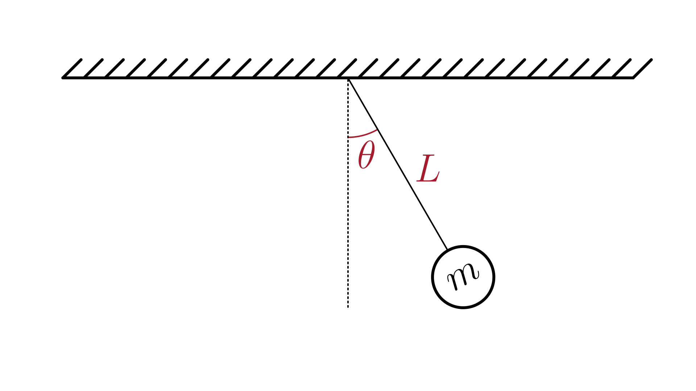

# Simple Pendulum System (Linear Model)

This section describes a simple **mechanical system** composed of a **point mass** suspended by a **massless, rigid rod** of length $L$ that swings under the influence of gravity.

The physical system is illustrated in the figure below:

The dynamics of the system are described in terms of the angular displacement $\theta(t)$ from the vertical:

$$
\frac{d^2 \theta(t)}{dt^2} = -\frac{g}{L} \cdot \theta(t)
$$

Where:

- $\theta(t)$: angular displacement [rad]
- $L$: pendulum length [m]
- $g$: gravitational acceleration [m/s²]

> Note: This model contains one or more **second-order ODEs**.
> Most numerical solvers require the system to be expressed as first-order equations.
> For details on how to do this, see [Reducing Higher-Order ODEs](/docs/ode-reduction.md).

## Model Assumptions

This model builds on the assumptions of the [Simple Pendulum System](/models/mechanical/simple-pendulum/README.md).

In addition, we assumed small angular displacements ($|\theta| \ll 1 \, \text{rad}$), allowing the approximation $\sin(\theta) \approx \theta$.

## Model Classification

| Property                                 | Classification      |
| ---------------------------------------- | ------------------- |
| Static × Dynamic                         | **Dynamic**         |
| Linear × Nonlinear                       | **linear**          |
| SISO × SIMO × MISO × MIMO                | **Not applicable**  |
| Continuous-time × Discrete-time          | **Continuous-time** |
| Time-invariant × Time-variant            | **Time-invariant**  |
| Lumped-parameters × Distributed-elements | **Lumped**          |
| Deterministic × Stochastic               | **Deterministic**   |

## Model Derivation

Following the derivation of the [nonlinear simple pendulum](/models/mechanical/simple-pendulum/README.md), we apply the **small-angle approximation** for $|\theta| \ll 1$, where:

$$
\sin(\theta) \approx \theta
$$

Starting from the nonlinear equation of motion:

$$
\frac{d^2 \theta(t)}{dt^2} = -\frac{g}{L} \sin(\theta(t))
$$

we obtain the **linearized equation of motion**:

$$
\boxed{
\frac{d^2 \theta(t)}{dt^2} = - \frac{g}{L} \theta(t)
}
$$

This linear model is valid for **small oscillations**, typically $\theta \lesssim 10^\circ$.
