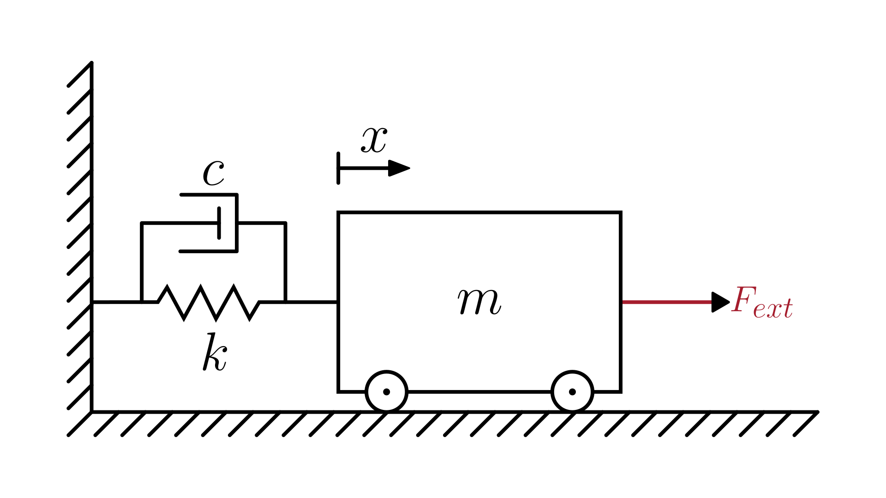

# Mass–Spring–Damper System

> This model follows the general assumptions of **mechanical system models**.
> For details, see [Mechanical Systems](/models/mechanical/README.md).

This section describes a simple **mechanical system** composed of a **mass**, a **spring**, and a **damper** connected in parallel.

The physical system is illustrated in the figure below:

The dynamics of the system are described in terms of the mass displacement $x(t)$:

$$
\frac{d^2 x(t)}{dt^2} = \frac{1}{m} \left(F_{ext}(t) - c \frac{dx(t)}{dt} - k x(t)\right)
$$

Where:

- $x(t)$: displacement of the mass [m]
- $m$: mass [kg]
- $c$: damping coefficient [N·s/m]
- $k$: spring stiffness [N/m]
- $F_{ext}(t)$: external force applied to the mass [N]

> Note: This model contains one or more **second-order ODEs**.
> Most numerical solvers require the system to be expressed as first-order equations.
> For details on how to do this, see [Reducing Higher-Order ODEs](/docs/ode-reduction.md).

## Model Classification

| Property                                 | Classification      |
| ---------------------------------------- | ------------------- |
| Static × Dynamic                         | **Dynamic**         |
| Linear × Nonlinear                       | **Linear**          |
| SISO × SIMO × MISO × MIMO                | **SISO**            |
| Continuous-time × Discrete-time          | **Continuous-time** |
| Time-invariant × Time-variant            | **Time-invariant**  |
| Lumped-parameters × Distributed-elements | **Lumped**          |
| Deterministic × Stochastic               | **Deterministic**   |

## Model Derivation

1. Applying [Newton’s Second Law](/docs/newton-laws.md) to the mass:

   The sum of all forces acting on the mass equals its mass times acceleration:

   $`F_{net}(t) = m \frac{d^2 x(t)}{dt^2}`$

   The net force is the result of the external applied force minus the restoring and damping forces:

   $`F_{net}(t) = F_{ext}(t) - F_k(t) - F_c(t)`$

   Combining both expressions gives:

   $`F_{ext}(t) - F_k(t) - F_c(t) = m \frac{d^2 x(t)}{dt^2}`$

   where:

   - $F_{ext}(t)$ is the external applied force
   - $F_k(t)$ is the spring force
   - $F_c(t)$ is the damping force

2. Applying the [constitutive equations](/docs/mechanical-components.md) of the spring and damper:

   $`F_{ext}(t) - k x(t) - c \frac{dx(t)}{dt} = m \frac{d^2 x(t)}{dt^2}.`$

3. Rearranging to isolate the acceleration term:

   $`\boxed{
      \frac{d^2 x(t)}{dt^2} = \frac{1}{m} \left(F_{ext}(t) - c \frac{dx(t)}{dt} - k x(t)\right)
   }`$
