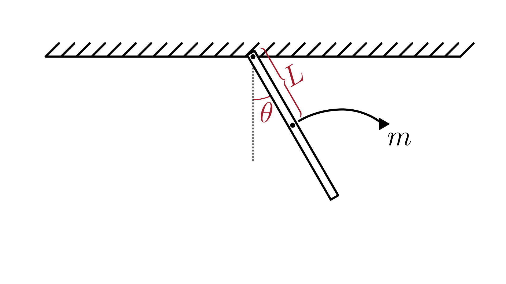

# Physical Pendulum System

This section describes a **physical pendulum**, which is a **rigid, uniform rod** of mass $m$ and length $2 \cdot L$, pivoted at one end and swinging under the influence of gravity.
Unlike the simple pendulum, the mass is distributed along the rod, and air resistance is modeled as a viscous damping torque.

The physical system is illustrated in the figure below:

The dynamics of the system are described in terms of the angular displacement $\theta(t)$ from the vertical:

$$
\ddot{\theta} = - \frac{k}{J} \dot{\theta} - \frac{3 g}{4 L} \sin(\theta)
$$

Where:

- $\theta(t)$: angular displacement [rad]
- $L$: distance from the pivot to the **center of mass** (for a uniform rod, half the rod length) [m]
- $m$: mass of the rod [kg]
- $J$: moment of inertia of the rod about the pivot point [kg·m²]
- $g$: gravitational acceleration [m/s²]
- $k$: damping coefficient [N·m·s/rad]

> Note: This model contains one or more **second-order ODEs**.
> Most numerical solvers require the system to be expressed as first-order equations.
> For details on how to do this, see [Reducing Higher-Order ODEs](/docs/ode-reduction.md).

## Model Assumptions

This model builds on the general assumptions of **mechanical system models**.
For details on the general assumptions, see [Mechanical Systems](/models/mechanical/README.md).

In addition, for the physical pendulum system, we assume:

- The rod is **rigid and uniform**, with mass distributed along its length.
- The pivot point is fixed and frictionless.
- The rod rotates in a vertical plane under the influence of gravity.
- Air resistance is considered and modeled as a **viscous damping torque**.

## Model Classification

| Property                                 | Classification      |
| ---------------------------------------- | ------------------- |
| Static × Dynamic                         | **Dynamic**         |
| Linear × Nonlinear                       | **Nonlinear**       |
| SISO × SIMO × MISO × MIMO                | **Not applicable**  |
| Continuous-time × Discrete-time          | **Continuous-time** |
| Time-invariant × Time-variant            | **Time-invariant**  |
| Lumped-parameters × Distributed-elements | **Lumped**          |
| Deterministic × Stochastic               | **Deterministic**   |

## Model Derivation

We will derive the equation of motion using **Lagrangian mechanics**.
For an introduction to this method, see [Lagrangian Mechanics](/docs/lagrangian-mechanics.md).

1. Define the coordinates of the mass

   The pivot point (at the top of the rod) is taken as the origin of the coordinate system.
   We adopt a convention where the y-axis points downward.
   The rod forms a right triangle, where the length from the pivot to the center of mass is $L$.
   Thus, the position of the center of mass is:

   $`x_c = L \cdot \sin(\theta)`$

   $`y_c = L - L \cdot \cos(\theta)`$

2. Compute the velocity components

   The time derivatives of these coordinates are obtained using the **chain rule**, since the angle $\theta$ varies with time.
   Differentiating $x_c$ and $y_c$ with respect to time gives:

   $`\dot{x}_c = L \cdot \cos(\theta) \cdot \dot{\theta}`$

   $`\dot{y}_c = L \cdot \sin(\theta) \cdot \dot{\theta}`$

3. Write the expressions for the energies

   > For more details about kinetic and potential energy, see [Energy](/docs/energy.md).

   The total energy of the system consists of **kinetic** and **potential** contributions:

   - **Kinetic energy**: Since the rod has mass and rotates about the pivot, its kinetic energy is purely rotational:

     $`T = \frac{1}{2} J \dot{\theta}^2`$

     Where $J$ is the moment of inertia of the rod about the pivot.

   - **Potential energy**: Due to gravity, based on the vertical position of the center of mass $y_c$:

     $`V = m \cdot g \cdot y_c = m \cdot g \cdot L \cdot (1 - \cos(\theta))`$

4. Form the Lagrangian

   The Lagrangian of the system is defined as the difference between kinetic and potential energy:

   $`L = T - V`$

   Substituting the expressions for kinetic and potential energy, the Lagrangian of the system is:

   $`L = \frac{1}{2} J \dot{\theta}^2 - m g L (1 - \cos(\theta))`$

5. Apply the Lagrange’s equation

   $`\frac{d}{dt}\left(\frac{\partial L}{\partial \dot{\theta}}\right) - \frac{\partial L}{\partial \theta} = Q_\theta`$

   where $Q_\theta = -k \dot{\theta}$ represents the **damping torque**.

   Compute the derivatives:

   $`\frac{\partial L}{\partial \dot{\theta}} = J \dot{\theta}`$
   $`\frac{d}{dt}\left(\frac{\partial L}{\partial \dot{\theta}}\right) = J \ddot{\theta}`$
   $`\frac{\partial L}{\partial \theta} = -m g L \sin(\theta)`$

   Substituting into the Lagrange’s equation:

   $`J \ddot{\theta} + m g L \sin(\theta) = -k \dot{\theta}`$

6. Express the moment of inertia in terms of the full rod length

   Let the total rod length be $L_t = 2 L$. Then, the moment of inertia of the rod about the pivot is:

   $`
   J = \frac{1}{3} m L_t^2 = \frac{1}{3} m (2 L)^2 = \frac{4}{3} m L^2
   `$

   Substituting $J = \frac{4}{3} m L^2$ into the equation of motion:

   $`
   \frac{4}{3} m L^2 \ddot{\theta} + k \dot{\theta} + m g L \sin(\theta) = 0
   `$

7. Simplify and isolate $\ddot{\theta}$

   Dividing both sides by $J = \frac{4}{3} m L^2$:

   $`\boxed{
   \ddot{\theta} = - \frac{k}{J} \dot{\theta} - \frac{3 g}{4 L} \sin(\theta)
   }`$

   This is the **final simplified equation of motion** for the physical pendulum.
