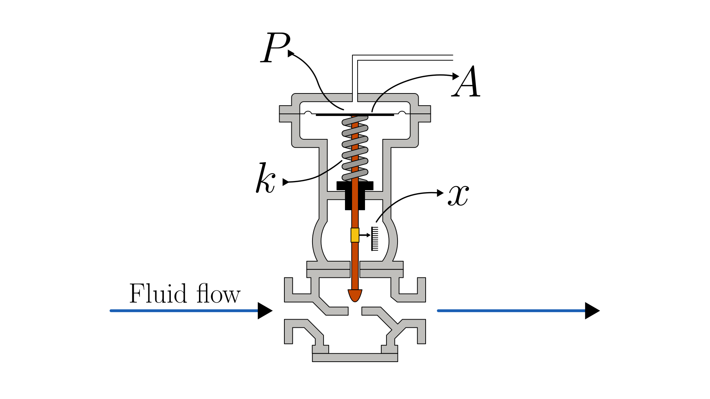

# Pneumatic Control Valve

> This model follows the general assumptions of **mechanical system models**.
> For details, see [Mechanical Systems](/models/mechanical/README.md).

This section describes a pneumatic control valve modeled as a mass–spring–damper system, where the actuator stem (connected to the valve plug) moves due to the pressure force acting on the diaphragm area, opposed by spring and viscous friction forces.

In this configuration, the valve is air-to-close (normally open), meaning that without pneumatic pressure, the spring keeps the valve in the open position.

The physical system is illustrated in the figure below:

The dynamics of the system are described in terms of the valve stem displacement $x(t)$:

$$
   \frac{d^2 x(t)}{dt^2} = \frac{1}{m} \left(A \cdot P(t) - b \frac{dx(t)}{dt} - k x(t)\right)
$$

Where:

- $x(t)$: valve stem displacement [m]
- $m$: equivalent moving mass [kg]
- $b$: viscous friction coefficient [N·s/m]
- $k$: spring stiffness [N/m]
- $A$: effective diaphragm area where the pressure acts [m²]
- $P(t)$: pneumatic gauge pressure applied to the actuator diaphragm [Pa]

## Model Classification

| Property                                 | Classification      |
| ---------------------------------------- | ------------------- |
| Static × Dynamic                         | **Dynamic**         |
| Linear × Nonlinear                       | **Linear**          |
| SISO × SIMO × MISO × MIMO                | **SISO**            |
| Continuous-time × Discrete-time          | **Continuous-time** |
| Time-invariant × Time-variant            | **Time-invariant**  |
| Lumped-parameters × Distributed-elements | **Lumped**          |
| Deterministic × Stochastic               | **Deterministic**   |

## Model Derivation

1. Applying [Newton’s Second Law](/docs/newton-laws.md) to the valve mass:

   The sum of all forces acting on the valve equals its mass times acceleration:

   $`F_{net}(t) = m \frac{d^2 x(t)}{dt^2}`$

   The net force is the result of the pneumatic pressure force minus the viscous friction and spring restoring forces:

   $`F_{net}(t) = A P(t) - F_b(t) - F_k(t)`$

   Combining both expressions gives:

   $`A P(t) - F_b(t) - F_k(t) = m \frac{d^2 x(t)}{dt^2}`$

   where:

   - $F_b(t)$ is the viscous damping (friction) force
   - $F_k(t)$ is the spring restoring force
   - $A P(t)$ is the pneumatic actuation force

2. Applying the [constitutive equations](/docs/mechanical-components.md) of the spring and damper:

   $`F_k(t) = k x(t), \quad F_b(t) = b \frac{dx(t)}{dt}`$

   Substituting:

   $`A P(t) - b \frac{dx(t)}{dt} - k x(t) = m \frac{d^2 x(t)}{dt^2}`$

3. Rearranging to isolate the acceleration term:

   $`\boxed{
      \frac{d^2 x(t)}{dt^2} = \frac{1}{m} \left(A P(t) - b \frac{dx(t)}{dt} - k x(t)\right)
   }`$
