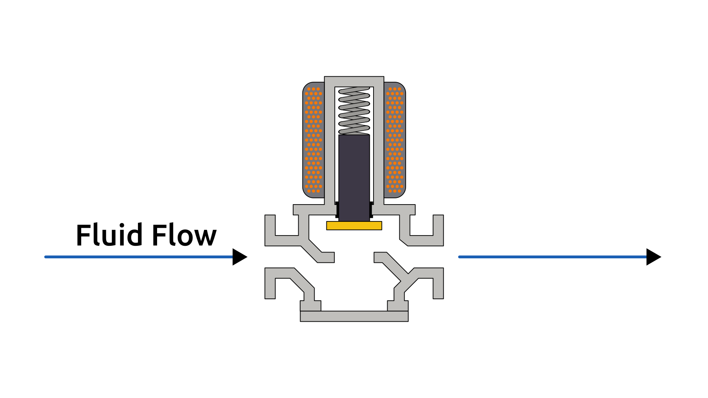

# Solenoid Valve

This section describes a simplified **solenoid valve model**, which converts **electrical energy** into **mechanical motion** through electromagnetic actuation.

This is a normally closed valve, meaning that in its default, unpowered state, the fluid flow is blocked.

The physical system is illustrated in the figure below:

The model consists of two coupled subsystems: the **electrical coil** and the **mechanical plunger**.
The coil generates a magnetic field that produces a force on the plunger, which in turn moves against spring and fluid forces.

The dynamics of the system are described in terms of the valve plunger displacement $x(t)$ and the coil current $i(t)$:

$$
\begin{cases}
   \displaystyle m \ddot{x}(t) + c \dot{x}(t) + k x(t) + F_f(x) = F_m(i, x) \\ \\
   \displaystyle u(t) = R i(t) + L(x) \frac{d i(t)}{dt} + i(t) \frac{dL(x)}{dx} \dot{x}(t)
\end{cases}
$$

The algebraic relations of the model are given by the expressions below:

- The **position-dependent inductance** and its spatial derivative:

  $L(x) = L_0 + \frac{L_1}{g_0 - x}$

  $\frac{dL(x)}{dx} = \frac{L_1}{(g_0 - x)^2}$

- The **magnetic force** generated by the coil:

  $F_m(i, x) = \frac{1}{2} \frac{dL(x)}{dx} i(t)^2$

- The **fluid force** acting on the plunger:

  $F_f(x) = \Delta P \cdot A \cdot \alpha(x)$

- The **opening factor**:

  $\alpha(x) = \frac{x}{x_{\max}}$

The symbols used in the equations above are defined as follows:

- **Mechanical**

  - $x(t)$: valve plunger displacement, limited between the fully closed position $x_{\min} = 0$ and the fully open position $x_{\max}$ [m]
  - $m$: equivalent moving mass [kg]
  - $c$: viscous damping coefficient [N·s/m]
  - $k$: spring stiffness [N/m]

- **Electrical**

  - $i(t)$: coil current [A]
  - $u(t)$: applied coil voltage [V]
  - $R$: coil electrical resistance [Ω]
  - $L(x)$: position-dependent coil inductance [H]

- **Other Symbols**

  - $L_0$, $L_1$, $g_0$: inductance model constants
  - $\Delta P$: pressure differential acting on the plunger (the fluid pressure acting as an external disturbance) [Pa]
  - $A$: effective area over which the pressure acts [m²]
  - $\alpha(x)$: opening factor, constrained between 0 (closed) and 1 (open).

> Note: This model contains one or more **second-order ODEs**.
> Most numerical solvers require the system to be expressed as first-order equations.
> For details on how to do this, see [Reducing Higher-Order ODEs](/docs/ode-reduction.md).

## Model Assumptions

This system is an **electromechanical system**, meaning it involves both **electrical** and **mechanical** domains working together.

This model builds on the general assumptions of both **mechanical system models** and **electrical system models**.
For details on the general assumptions, see:

- [Mechanical Systems](/models/mechanical/README.md)
- [Electrical Systems](/models/electrical/README.md)

In addition, for the **Solenoid Valve**, we assume:

- The system is single-axis. Lateral or rotational motions of the plunger are ignored.
- External disturbances (vibrations, noise, or shocks) are not considered.

## Model Classification

| Property                                 | Classification      |
| ---------------------------------------- | ------------------- |
| Static × Dynamic                         | **Dynamic**         |
| Linear × Nonlinear                       | **Nonlinear**       |
| SISO × SIMO × MISO × MIMO                | **MIMO**            |
| Continuous-time × Discrete-time          | **Continuous-time** |
| Time-invariant × Time-variant            | **Time-variant**    |
| Lumped-parameters × Distributed-elements | **Distributed**     |
| Deterministic × Stochastic               | **Deterministic**   |
| Forced × Homogeneous                     | **Forced**          |

## Model Derivation

### 1. Mechanical Subsystem

1. Applying [Newton’s Second Law](/docs/newton-laws.md) to the valve mass:

   The sum of all forces acting on the valve equals its mass times acceleration:

   $`F_{net}(t) = m \frac{d^2 x(t)}{dt^2}`$

   The net force is composed of the **magnetic force**, minus the **damping**, **spring**, and **fluid** forces:

   $`F_{\text{net}}(t) = F_m(t) - F_b(t) - F_k(t) - F_f(t)`$

   where:

   - $F_m(t)$ is the electromagnetic actuation force
   - $F_b(t)$ is the viscous damping force
   - $F_k(t)$ is the spring restoring force
   - $F_f(t)$ is the fluid pressure force

   Equating both expressions:

   $`F_m(t) - F_b(t) - F_k(t) - F_f(t) = m \frac{d^2 x(t)}{dt^2}`$

2. Applying the [constitutive equations](/docs/mechanical-components.md) of the spring and damper:

   $`\boxed{m \ddot{x}(t) + c \dot{x}(t) + k x(t) + F_f(x) = F_m(i, x)}`$

3. Defining algebraic equations:

   For $F_m(t)$ and $F_f(t)$ we use the algebraic relations defined below:

   $`F_m(t) = \tfrac{1}{2}\, \tfrac{dL(x)}{dx}\, i(t)^2`$

   $`F_f(t) = \Delta P \cdot A \cdot \alpha(x), \quad \alpha(x)=\tfrac{x}{x_{\max}}`$

### Electrical Subsystem

1. Applying [Kirchhoff’s Voltage Law](/docs/kirchhoff-laws.md) to the loop:

   $`u(t) = R \cdot i(t) + e_L(t)`$

   where $`e_L(t)`$ is the induced (back) EMF across the coil.

2. Deriving the induced voltage from the flux linkage:

   For a position-dependent inductance $L(x)$, the induced voltage does not follow the simple back-EMF expression presented in [Circuit Components](/docs/electronic-components.md).

   In a solenoid actuator the coil is stationary, instead, the plunger motion changes the inductance, and thus the flux linkage:

   $`\lambda(x,t) = L(x) \cdot i(t).`$

   Applying [Faraday’s Law](/docs/faraday.md):

   $`e_L(t) = \frac{d\lambda}{dt} = \frac{d}{dt} ( L(x) \cdot i(t))`$

   Using the Product Rule and the Chain Rule for multivariable functions:

   $`e_L(t) = L(x)\,\frac{d i(t)}{dt} + i(t)\,\frac{dL(x)}{dx}\,\frac{dx(t)}{dt}`$

3. Finishing

   Thus, the electrical equation becomes:

   $`
    \boxed{
    u(t) = R\,i(t) + L(x)\,\frac{d i(t)}{dt} + i(t)\,\frac{dL(x)}{dx}\,\frac{dx(t)}{dt}
    }
    `$

   with the inductance model:

   $`L(x) = L_0 + \frac{L_1}{g_0 - x},`$

   and its spatial derivative:

   $`\frac{dL(x)}{dx} = \frac{L_1}{(g_0 - x)^2}.`$
