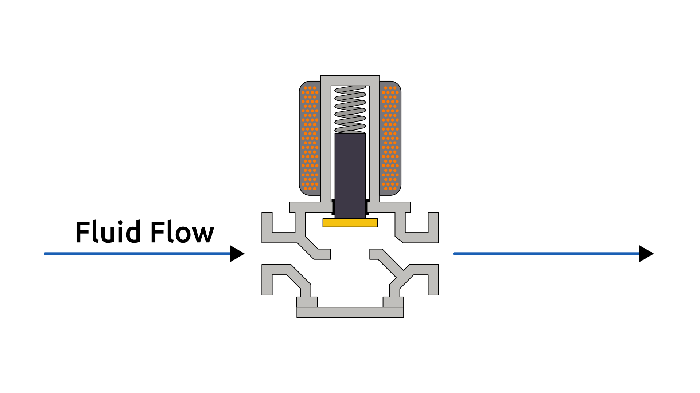

# Solenoid Valve

This section describes a simplified **solenoid valve model**, which converts **electrical energy** into **mechanical motion** through electromagnetic actuation.

The physical system is illustrated in the figure below:

The model consists of two coupled subsystems: the **electrical coil** and the **mechanical plunger**.
The coil generates a magnetic field that produces a force on the plunger, which in turn moves against spring and fluid forces.

The dynamics of the system are described in terms of the valve stem displacement $x(t)$:

$$
u(t) = R \cdot i(t) + L(x) \cdot \frac{\partial i(t)}{\partial t} + i(t) \frac{\partial L(x)}{\partial x} \dot{x}(t)
$$

$$
m \cdot \ddot{x}(t) + c \cdot \dot{x}(t) + k \cdot x(t) + F_f(x) = F_m(i, x)
$$

Where:

- $x(t)$: valve stem displacement [m]
- $m$: equivalent moving mass [kg]
- $b$: viscous friction coefficient [N·s/m]
- $k$: spring stiffness [N/m]
- $A$: effective diaphragm area where the pressure acts [m²]
- $P(t)$: pneumatic gauge pressure applied to the actuator diaphragm [Pa]

In practice, the stem displacement is **physically constrained** between two limits:

$$
x_{\min} \le x(t) \le x_{\max}
$$

where

- $x_{\min}$ corresponds to the fully open valve position
- $x_{\max}$ corresponds to the fully closed valve position.

> Note: This model contains one or more **second-order ODEs**.
> Most numerical solvers require the system to be expressed as first-order equations.
> For details on how to do this, see [Reducing Higher-Order ODEs](/docs/ode-reduction.md).

## Model Classification

| Property                                 | Classification      |
| ---------------------------------------- | ------------------- |
| Static × Dynamic                         | **Dynamic**         |
| Linear × Nonlinear                       | **Linear**          |
| SISO × SIMO × MISO × MIMO                | **SISO**            |
| Continuous-time × Discrete-time          | **Continuous-time** |
| Time-invariant × Time-variant            | **Time-invariant**  |
| Lumped-parameters × Distributed-elements | **Lumped**          |
| Deterministic × Stochastic               | **Deterministic**   |
| Forced × Homogeneous                     | **Forced**          |

## Books and Publications

This model can be found in the following literature:

- Ogata, K. (2011). _Modern control engineering_ (5th ed.). Prentice Hall.

If you find or publish a paper or book using this model, please consider adding it to this list. [Contributions](/docs/contributing.md) of other references are also welcome.

## Model Derivation

1. Applying [Newton’s Second Law](/docs/newton-laws.md) to the valve mass:

   The sum of all forces acting on the valve equals its mass times acceleration:

   $`F_{net}(t) = m \frac{d^2 x(t)}{dt^2}`$

   The net force is the result of the pneumatic pressure force minus the viscous friction and spring restoring forces:

   $`F_{net}(t) = A P(t) - F_b(t) - F_k(t)`$

   Combining both expressions gives:

   $`A P(t) - F_b(t) - F_k(t) = m \frac{d^2 x(t)}{dt^2}`$

   where:

   - $F_b(t)$ is the viscous damping (friction) force
   - $F_k(t)$ is the spring restoring force
   - $A P(t)$ is the pneumatic actuation force

2. Applying the [constitutive equations](/docs/mechanical-components.md) of the spring and damper:

   $`F_k(t) = k x(t), \quad F_b(t) = b \frac{dx(t)}{dt}`$

   Substituting:

   $`A P(t) - b \frac{dx(t)}{dt} - k x(t) = m \frac{d^2 x(t)}{dt^2}`$

3. Rearranging to isolate the acceleration term:

   $`\boxed{
      \frac{d^2 x(t)}{dt^2} = \frac{1}{m} \left(A P(t) - b \frac{dx(t)}{dt} - k x(t)\right)
   }`$
