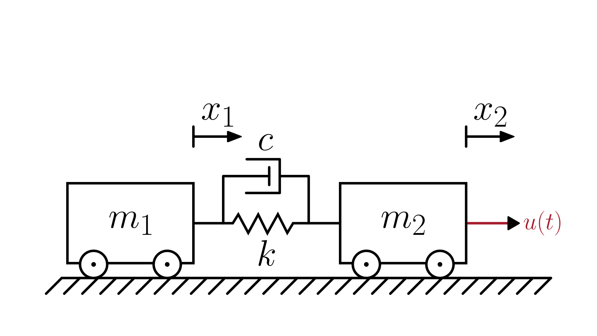

# Two-Mass–Spring–Damper System

> This model follows the general assumptions of **mechanical system models**.
> For details, see [Mechanical Systems](/models/mechanical/README.md).

This section describes a mechanical system composed of **two masses** connected by a **spring** and a **damper**.
Each mass can move linearly, and the spring–damper pair resists their **relative motion**.

The physical system is illustrated in the figure below:

The dynamics are described in terms of the positions of each mass, $x_1(t)$ and $x_2(t)$:

$$
\begin{cases}
   \displaystyle \frac{d^2 x_1}{dt^2} = \frac{c(\dot{x}_2 - \dot{x}_1) + k(x_2 - x_1)}{m_1} \\[1em]
   \displaystyle \frac{d^2 x_2}{dt^2} = \frac{u(t) - c(\dot{x}_2 - \dot{x}_1) - k(x_2 - x_1)}{m_2}
\end{cases}
$$

Where:

- $x_1(t)$: position of mass 1 [m]
- $x_2(t)$: position of mass 2 [m]
- $m_1$: mass of block 1 [kg]
- $m_2$: mass of block 2 [kg]
- $c$: damping coefficient [N·s/m]
- $k$: spring stiffness [N/m]
- $u(t)$: external force applied to mass 2 [N]

## Model Classification

| Property                                 | Classification      |
| ---------------------------------------- | ------------------- |
| Static × Dynamic                         | **Dynamic**         |
| Linear × Nonlinear                       | **Linear**          |
| SISO × SIMO × MISO × MIMO                | **SIMO**            |
| Continuous-time × Discrete-time          | **Continuous-time** |
| Time-invariant × Time-variant            | **Time-invariant**  |
| Lumped-parameters × Distributed-elements | **Lumped**          |
| Deterministic × Stochastic               | **Deterministic**   |

## Model Derivation

1. Apply [Newton’s Second Law](/docs/newton-laws.md) to each mass:

   $`F_{net} = m \frac{d^2 x(t)}{dt^2}`$

   For the **first mass**, the net force is the sum of the spring and damper forces from the second mass (positive in the direction of increasing $x_1$):

   $`F_{net,1} = F_k + F_c`$

   For the **second mass**, the net force includes the external force $u$ minus the spring and damper forces, since they act opposite to its motion:

   $`F_{net,2} = u - F_k - F_c`$

   Substituting the forces into Newton's Second Law gives the system of equations:

   $`\begin{cases}
   F_k + F_c = m_1 \frac{d^2 x_1(t)}{dt^2} \\[1em]
   u - F_k - F_c = m_2 \frac{d^2 x_2(t)}{dt^2}
   \end{cases}`$

   where

   - $F_k$ is the spring force [N]
   - $F_c$ is the damping force [N]

2. Applying the [constitutive equations](/docs/mechanical-components.md) of the spring and damper:

   $`\begin{cases}
   k(x_2 - x_1) + c(\dot{x}_2 - \dot{x}_1) = m_1 \frac{d^2 x_1(t)}{dt^2} \\[1em]
   u(t) - k(x_2 - x_1) - c(\dot{x}_2 - \dot{x}_1) = m_2 \frac{d^2 x_2(t)}{dt^2}
   \end{cases}`$

3. Rearranging to isolate the acceleration terms:

   $`\boxed{
      \begin{cases}
         \displaystyle \frac{d^2 x_1}{dt^2} = \frac{c(\dot{x}_2 - \dot{x}_1) + k(x_2 - x_1)}{m_1} \\[1em]
         \displaystyle \frac{d^2 x_2}{dt^2} = \frac{u(t) - c(\dot{x}_2 - \dot{x}_1) - k(x_2 - x_1)}{m_2}
      \end{cases}
   }`$
