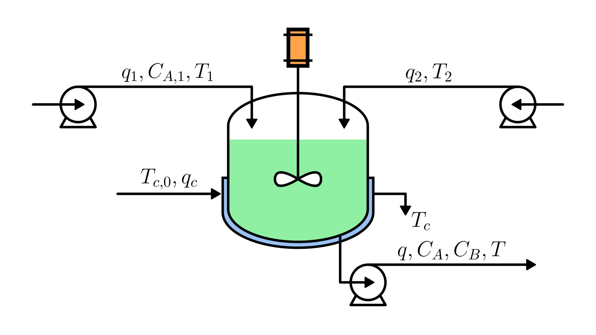

# Continuous Stirred Tank Reactor (CSTR) with Cooling Jacket

This system describes the dynamic model of a continuous stirred tank reactor (CSTR) in which an irreversible, elementary chemical reaction converts species A into species B.
The reaction is catalyzed by a small amount of catalyst continuously fed to the reactor.
The reactor is equipped with a cooling jacket to remove the heat generated by the exothermic reaction.

The physical system is illustrated in the figure:

The dynamic behavior of the reactor and the cooling jacket is described by the following set of equations:

$$
\begin{cases}
  \displaystyle \frac{dV}{dt} = q_1 - q \\
  \displaystyle V \frac{dC_A}{dt} = (C_{A,1} - C_A) q_1 - \Gamma V \\
  \displaystyle \rho V c_p \frac{dT}{dt} = \rho q_1 c_p (T_1 - T) + (-\Delta H_r)\Gamma V + U A (T_c - T) \\
  \displaystyle \rho_c V_c c_{p,c} \frac{dT_c}{dt} = \rho_c q_c c_{p,c} (T_{c0} - T_c) - U A (T_c - T)
\end{cases}
$$

Where:

- $V$: reactor liquid volume [m³]
- $q_1$: inlet volumetric flow rate to the reactor [m³/s]
- $q$: outlet volumetric flow rate from the reactor [m³/s]
- $\rho$: density of the reacting mixture [kg/m³]

- $C_{A,1}$: inlet concentration of species A [mol/m³]
- $C_A$: concentration of species A in the reactor [mol/m³]
- $\Gamma$: reaction rate per unit volume [mol/(m³·s)]

- $T$: reactor temperature [K]
- $T_1$: inlet stream temperature [K]
- $c_p$: specific heat capacity of the reacting mixture [J/(kg·K)]
- $\Delta H_r$: reaction enthalpy (negative for exothermic reactions) [J/mol]
- $U$: overall heat transfer coefficient between reactor and jacket [W/(m²·K)]
- $A$: heat transfer area [m²]
- $T_c$: cooling jacket temperature [K]

- $V_c$: cooling jacket volume [m³]
- $q_c$: coolant volumetric flow rate [m³/s]
- $\rho_c$: coolant density [kg/m³]
- $c_{p,c}$: coolant specific heat capacity [J/(kg·K)]
- $T_{c0}$: inlet coolant temperature [K]

The reaction rate follows the Arrhenius law:

$$
\Gamma = k_0 \exp\left(-\frac{E}{RT}\right) C_A
$$

Where:

- $k_0$: pre-exponential factor of the Arrhenius equation [1/s]
- $E$: activation energy of the reaction [J/mol]
- $R$: universal gas constant [J/(mol·K)]
- $T$: reactor temperature [K]
- $C_A$: concentration of species A in the reactor [mol/m³]

> The pre-exponential factor $k_0$ accounts for the effect of the catalyst and is assumed to depend on the catalyst inlet flow rate $q_2$. Since the catalyst is fed in small amounts and is well mixed in the reactor, its influence is incorporated into $k_0$, and no separate mass balance for the catalyst is considered.

## Model Assumptions

- Perfect mixing in both the reactor and the cooling jacket.
- The reaction is elementary and irreversible.
- No heat losses to the environment.
- No shaft work.
- Kinetic and potential energy effects are negligible.
- Constant heat transfer area and overall heat transfer coefficient.
- The liquid phase is considered incompressible and is predominantly composed of solvent. The presence of solutes does not significantly affect the fluid density ($\rho$ is assumed to be constant).
- The catalyst inlet flow rate $q_2$ is sufficiently small that it does not influence the overall mass balance.
- The thermal contribution of the catalyst stream is negligible, and the inlet temperature $T_2$ does not modify the energy balance.

## Model Classification

| Property                                 | Classification      |
| ---------------------------------------- | ------------------- |
| Static × Dynamic                         | **Dynamic**         |
| Linear × Nonlinear                       | **Nonlinear**       |
| SISO × SIMO × MISO × MIMO                | **MIMO**            |
| Continuous-time × Discrete-time          | **Continuous-time** |
| Time-invariant × Time-variant            | **Time-invariant**  |
| Lumped-parameters × Distributed-elements | **Lumped**          |
| Deterministic × Stochastic               | **Deterministic**   |
| Forced × Homogeneous                     | **Forced**          |
