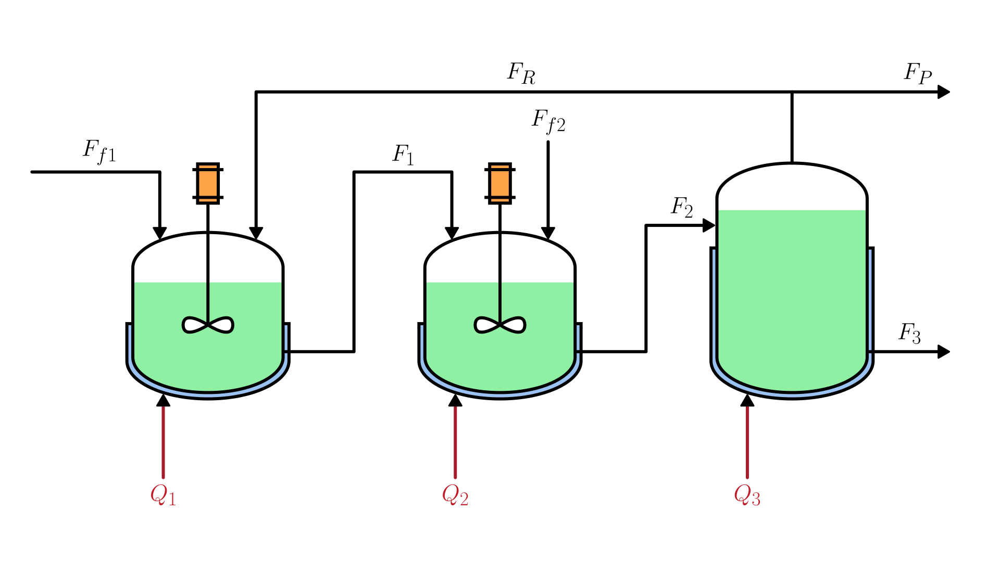

# Reactor-Separator Integrated Process Network

This system describes the dynamic model of an integrated process network consisting of two continuous stirred tank reactors (CSTRs) and a liquid-vapor separator.
Two series first-order exothermic reactions convert species A into B and then B into C.
The feedstreams contain only component A, while component B is the desired product and C is the side product.
The separator bottom stream contains the products, a recycle stream returns to the first reactor, and a purge stream avoids side product accumulation.

The physical system is illustrated in the figure:

The dynamic behavior of the reactors and separator is described by the following set of equations:

$$
\begin{cases}
  \displaystyle \frac{dV_1}{dt} = F_{f1} + F_R - F_1 \\[6pt]
  \displaystyle \frac{dV_2}{dt} = F_{f2} + F_1 - F_2 \\[6pt]
  \displaystyle \frac{dV_3}{dt} = F_2 - F_P - F_R - F_3 \\[6pt]
  \displaystyle \frac{dT_1}{dt} = \frac{F_{f1}}{V_1}(T_0 - T_1) + \frac{F_R}{V_1}(T_3 - T_1) + \frac{Q_1}{\rho C_p V_1} - \frac{m}{C_p}(k_{11} x_{A1} \Delta H_{r1} + k_{21} x_{B1} \Delta H_{r2}) \\[6pt]
  \displaystyle \frac{dT_2}{dt} = \frac{F_{f2}}{V_2}(T_0 - T_2) + \frac{F_1}{V_2}(T_1 - T_2) + \frac{Q_2}{\rho C_p V_2} - \frac{m}{C_p}(k_{12} x_{A2} \Delta H_{r1} + k_{22} x_{B2} \Delta H_{r2}) \\[6pt]
  \displaystyle \frac{dT_3}{dt} = \frac{F_2}{V_3}(T_2 - T_3) + \frac{Q_3}{\rho C_p V_3} \\[6pt]
  \displaystyle \frac{dx_{A1}}{dt} = \frac{F_{f1}}{V_1}(x_{A0} - x_{A1}) + \frac{F_R}{V_1}(x_{AR} - x_{A1}) - k_{11} x_{A1} \\[6pt]
  \displaystyle \frac{dx_{B1}}{dt} = \frac{F_R}{V_1}(x_{BR} - x_{B1}) - \frac{F_{f1}}{V_1} x_{B1} + k_{11} x_{A1} - k_{21} x_{B1} \\[6pt]
  \displaystyle \frac{dx_{A2}}{dt} = \frac{F_{f2}}{V_2}(x_{A0} - x_{A2}) + \frac{F_1}{V_2}(x_{A1} - x_{A2}) - k_{12} x_{A2} \\[6pt]
  \displaystyle \frac{dx_{B2}}{dt} = \frac{F_1}{V_2}(x_{B1} - x_{B2}) - \frac{F_{f2}}{V_2} x_{B2} + k_{12} x_{A2} - k_{22} x_{B2} \\[6pt]
  \displaystyle \frac{dx_{A3}}{dt} = \frac{F_2}{V_3}(x_{A2} - x_{A3}) - \frac{F_P + F_R}{V_3}(x_{AR} - x_{A3}) \\[6pt]
  \displaystyle \frac{dx_{B3}}{dt} = \frac{F_2}{V_3}(x_{B2} - x_{B3}) - \frac{F_P + F_R}{V_3}(x_{BR} - x_{B3})
\end{cases}
$$

Where:

- $V_i$: volumetric holdup of unit $i$ [m³]
- $T_i$: temperature of unit $i$ [K]
- $x_{Ai}$, $x_{Bi}$: mole fractions of components A and B in unit $i$ [-]
- $F_{f1}$, $F_{f2}$: feed volumetric flow rates to reactors 1 and 2 [m³/h]
- $F_1$, $F_2$: outlet volumetric flow rates from reactors 1 and 2 [m³/h]
- $F_3$: product stream volumetric flow rate from the separator [m³/h]
- $F_R$: recycle volumetric flow rate [m³/h]
- $F_P$: purge volumetric flow rate [m³/h]
- $Q_1$, $Q_2$, $Q_3$: heat input rates to reactors 1, 2 and separator [kJ/h]
- $T_0$: feed temperature [K]
- $x_{A0}$: feed mole fraction of component A [-]
- $\rho$: fluid density [kg/m³]
- $C_p$: specific heat capacity of the fluid [kJ/(kg·K)]
- $m$: molality [kmol/kg]
- $x_{AR}$, $x_{BR}$: mole fractions of A and B in the recycle stream [-]

The reaction rate coefficients follow the Arrhenius law:

$$
k_{ri} = k_r^0 \exp\!\left(-\frac{E_r}{R T_i}\right), \quad r = 1, 2, \quad i = 1, 2
$$

Where:

- $k_r^0$: pre-exponential factor for reaction $r$ [1/s]
- $E_r$: activation energy for reaction $r$ [kJ/kmol]
- $R$: universal gas constant [kJ/(kmol·K)]
- $T_i$: temperature of reactor $i$ [K]

The mole fractions of each component in the recycle stream are computed assuming vapor-liquid equilibrium in the separator:

$$
x_{SR} = \frac{\alpha_S \, x_{S3}}{\displaystyle\sum_{S \in \{A,B,C\}} \alpha_S \, x_{S3}}, \quad S = A, B, C
$$

Where:

- $\alpha_S$: relative volatility of component $S$ [-]
- $x_{S3}$: mole fraction of component $S$ in the separator [-]

The purge flow rate is proportional to the recycle flow rate by a fixed purge ratio:

$$
F_P = \varepsilon \, F_R
$$

Where:

- $\varepsilon$: purge ratio [-]

## Model Assumptions

- Perfect mixing in each reactor and in the separator.
- Both reactions are elementary, first-order and irreversible.
- No heat losses to the environment.
- Physical properties of the fluid ($\rho$, $C_p$, $m$) are constant throughout the process.
- Vapor-liquid equilibrium is assumed instantaneously in the separator for computing the recycle composition.
- The purge ratio $\varepsilon$ is constant and small.
- The catalyst influence is incorporated into the pre-exponential factor $k_r^0$ and no separate catalyst balance is considered.
- The mole fraction of component C is obtained from the closure condition $x_C = 1 - x_A - x_B$.

## Model Classification

| Property                                 | Classification      |
| ---------------------------------------- | ------------------- |
| Static × Dynamic                         | **Dynamic**         |
| Linear × Nonlinear                       | **Nonlinear**       |
| SISO × SIMO × MISO × MIMO                | **MIMO**            |
| Continuous-time × Discrete-time          | **Continuous-time** |
| Time-invariant × Time-variant            | **Time-invariant**  |
| Lumped-parameters × Distributed-elements | **Lumped**          |
| Deterministic × Stochastic               | **Deterministic**   |
| Forced × Homogeneous                     | **Forced**          |

## Books and Publications

This model can be found in the following literature:

- Pourkargar, D. B., Almansoori, A., & Daoutidis, P. (2017). Distributed model predictive control of process networks: Impact of control architecture. _IFAC-PapersOnLine_, 50(1), 12452–12457. [https://doi.org/10.1016/j.ifacol.2017.08.1920](https://doi.org/10.1016/j.ifacol.2017.08.1920)

If you find or publish a paper or book using this model, please consider adding it to this list. [Contributions](/docs/contributing.md) of other references are also welcome.

## Model Derivation

> **TODO:** Add model derivation.
