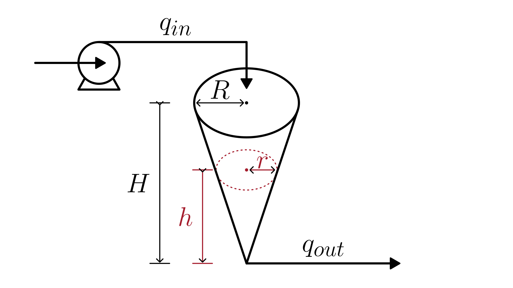

# Conical Tank with Gravity-Driven Outlet

This section describes the model of a **conical tank** with a **pumped inlet**.
The outlet flow is **gravity-driven** and depends on the liquid level.
The liquid level inside the tank changes according to the balance between the inflow and outflow rates.

The physical system is illustrated in the figure below:

The liquid level dynamics can be mathematically described by the following equation:

$$\frac{dh(t)}{dt} = \frac{H^2}{\pi \cdot R^2} \left(\frac{q_{in}}{h^2} - \frac{k}{\sqrt{h^3}}\right)$$

Where:

- $h(t)$: liquid level inside the tank [m]
- $H$: maximum height of the conical tank [m]
- $R$: radius of the tank at the top [m]
- $q_{in}$: volumetric inflow rate [m³/s]
- $k$: outlet discharge parameter [m $^{2.5}$/s]

The liquid level is physically constrained by the tank height:

$$0 \le h(t) \le H$$

## Model Assumptions

- The fluid is incompressible, with constant density.
- No chemical reactions, leaks, or evaporation are considered.
- Gravity-driven outlet follows Torricelli-type behavior
- The inlet flow is assumed known and measurable.
- The momentum dynamics in the outlet are neglected.

## Model Classification

| Property                                 | Classification      |
| ---------------------------------------- | ------------------- |
| Static × Dynamic                         | **Dynamic**         |
| Linear × Nonlinear                       | **Nonlinear**       |
| SISO × SIMO × MISO × MIMO                | **SISO**            |
| Continuous-time × Discrete-time          | **Continuous-time** |
| Time-invariant × Time-variant            | **Time-invariant**  |
| Lumped-parameters × Distributed-elements | **Lumped**          |
| Deterministic × Stochastic               | **Deterministic**   |
| Forced × Homogeneous                     | **Forced**          |

## Model Derivation

We want to model the liquid level $h(t)$ in a conic tank.

1. Mass Balance

   Write the [mass balance](/docs/mass-balance.md) of the liquid in the tank:

   $`\frac{dM(t)}{dt} = \dot{M}_{in}(t) - \dot{M}_{out}(t)`$

   Where $M(t)$ is the mass of the liquid [kg], and $\dot{M}_{in}$, $\dot{M}_{out}$ are the mass flow rates [kg/s].

   In this case, there are no generation or consumption terms, since the liquid does not undergo any chemical reactions and there are no internal sources or sinks of mass.
   Therefore, the balance reduces to a simple relation between the inlet and outlet flows.

2. Express in Terms of Volume

   Using the physical relation between mass, density, and volume (as well as between mass flow rate and volumetric flow rate), we can write:

   $`M(t) = \rho \cdot V(t), \quad \dot{M}_{in} = \rho \cdot q_{in}(t), \quad \dot{M}_{out} = \rho \cdot q_{out}(t)`$

   For an **incompressible fluid** with constant density $\rho$, we can take $\rho$ out of the derivative and simplify the equation:

   $`\frac{d}{dt} (\rho V(t)) = \rho q_{in}(t) - \rho q_{out}(t) \quad \Rightarrow \quad \frac{dV(t)}{dt} = q_{in}(t) - q_{out}(t)`$

   This is the **volumetric balance**.

3. Expressing Volume in Terms of Liquid Height

   To relate the liquid volume to its height, we use the fact that the liquid forms a smaller cone that is similar to the full conical tank. By similarity of triangles:

   $`\frac{r(h)}{h(t)} = \frac{R}{H}`$

   Solving for the radius of the liquid surface:

   $`\frac{r(h)}{h(t)} = \frac{R}{H}
   \quad\Rightarrow\quad
   r(h) = \frac{R}{H} \cdot h(t)`$

   Substitute this into the cone volume formula $V = \frac{1}{3}\pi r^2 h$:

   $`V(h) = \frac{1}{3}\pi \left(\frac{R}{H}h(t)\right)^2 h(t)`$

   Simplifying:

   $`V(h) = \frac{\pi R^2}{3H^2} \cdot h^3(t)`$

4. Put $`V(h)`$ Back into the Volumetric Balance

   $`\frac{d}{dt}\left(\frac{\pi R^2}{3H^2} h^3(t)\right) = q_{in}(t) - q_{out}(t)`$

   Solve the derivative with respect to time:

   $`\frac{d}{dt}\left(\frac{\pi R^2}{3H^2} h^3(t)\right) = \frac{\pi R^2}{3H^2} \cdot 3 h^2(t) \frac{dh}{dt}`$

   which simplifies to

   $`\frac{\pi R^2}{H^2} \cdot h^2(t) \cdot \frac{dh}{dt}`$.

   Go back to the volumetric balance and solve for $`\frac{dh}{dt}`$:

   $`\frac{\pi R^2}{H^2} \cdot h^2(t) \cdot \frac{dh}{dt} = q_{in}(t) - q_{out}(t)`$

   $`\frac{dh}{dt} = \frac{H^2}{\pi R^2} \cdot \frac{q_{in}(t)-q_{out}(t)}{h^2(t)}`$

5. Model the Outlet Flow and Substitute into the ODE

   For a gravity-driven outlet, the outflow is modeled as

   $`q_{out}(t) = k \sqrt{h(t)},`$

   where $k$ is a lumped discharge parameter.

   Substitute this expression into the differential equation obtained in step 4:

   $`\frac{dh}{dt} = \frac{H^2}{\pi R^2} \frac{q_{in}(t) - k\sqrt{h(t)}}{h^2(t)}`$

   Rewriting the powers of $h(t)$:

   $`\boxed{
      \frac{dh(t)}{dt} = \frac{H^2}{\pi \cdot R^2} \left(\frac{q_{in}}{h^2} - \frac{k}{\sqrt{h^3}}\right)
   }`$
