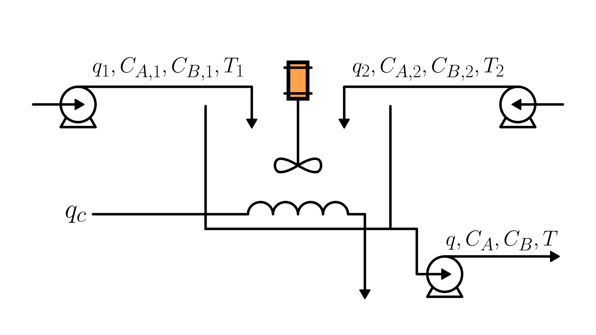

# Mixer with Heating

This system describes the dynamic model of a continuously stirred tank with steam heating.
Two inlet streams feed the tank, each carrying two chemical species: A and B.
Heating is provided by steam condensation inside a heating coil.
The outlet flow is a single mixed stream.

The physical system is illustrated in the figure:

The liquid volume, species concentrations, and temperature dynamics can be mathematically described by the following equations:

$$
\begin{cases}
   \displaystyle \frac{dV}{dt} = q_1 + q_2 - q \\
   \displaystyle \frac{dC_A}{dt} = \frac{(C_{A,1} - C_A) q_1 + (C_{A,2} - C_A) q_2}{V} \\
   \displaystyle \frac{dC_B}{dt} = \frac{(C_{B,1} - C_B) q_1 + (C_{B,2} - C_B) q_2}{V} \\
   \displaystyle \frac{dT}{dt} = \frac{\rho \cdot q_1 \cdot c_p (T_1 - T) + \rho \cdot q_2 \cdot c_p (T_2 - T) + \rho_c \cdot q_c \cdot \lambda}{\rho \cdot V \cdot c_p}
\end{cases}
$$

Where:

- $V$: tank liquid volume [m³]
- $q_1, q_2$: inlet volumetric flow rates [m³/s]
- $q$: outlet volumetric flow rate [m³/s]
- $C_{A,1}, C_{A,2}$: concentrations of species A in inlet streams 1 and 2 [mol/m³]
- $C_{B,1}, C_{B,2}$: concentrations of species B in inlet streams 1 and 2 [mol/m³]
- $C_A, C_B$: concentrations of species A and B in the tank [mol/m³]
- $T_1, T_2$: temperatures of inlet streams [K]
- $T$: tank temperature [K]
- $q_c$: condensate volumetric flow rate [m³/s] [m³/s]
- $\lambda$: latent heat of condensation [J/kg]
- $\rho$: liquid density [kg/m³]
- $c_p$: specific heat capacity of the tank liquid [J/(kg·K)]
- $\rho_c$: density of the condensed liquid leaving the heating coil [kg/m³]

The liquid volume is constrained by the physical requirement that it cannot be negative:

$$V(t) \ge 0$$

## Model Assumptions

- The fluid is incompressible, with constant density.
- All inlet volumetric flow rates and the outlet volumetric flow rate are known and measurable.
- Shaft work is negligible (weakly viscous fluid).
- Perfect and ideal mixing inside the tank.
- Kinetic and potential energy contributions are negligible.
- No chemical reactions occur in the tank.
- Mass accumulation inside the heating coil is negligible.
- The specific heat capacity $c_p$ of the tank liquid is constant.
- No leaks, evaporation, or any other unaccounted mass or energy losses occur.
- The steam used for heating is a pure condensable substance and enters and leaves the coil at its saturation temperature.
- The concentrations of species A and B are sufficiently low that their presence does not significantly alter the liquid density or the heat capacity.

## Model Classification

| Property                                 | Classification      |
| ---------------------------------------- | ------------------- |
| Static × Dynamic                         | **Dynamic**         |
| Linear × Nonlinear                       | **Nonlinear**       |
| SISO × SIMO × MISO × MIMO                | **MIMO**            |
| Continuous-time × Discrete-time          | **Continuous-time** |
| Time-invariant × Time-variant            | **Time-invariant**  |
| Lumped-parameters × Distributed-elements | **Lumped**          |
| Deterministic × Stochastic               | **Deterministic**   |
| Forced × Homogeneous                     | **Forced**          |
