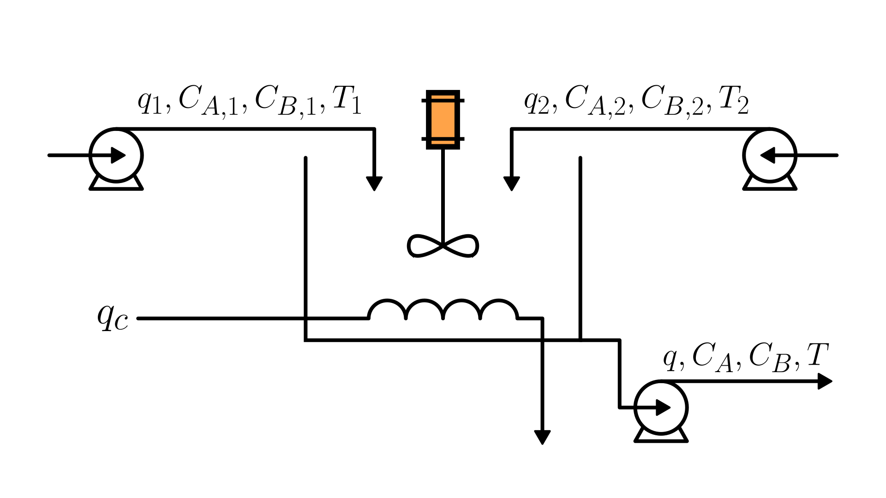

# Mixer with Heating

This system describes the dynamic model of a continuously stirred tank with steam heating.
Two inlet streams feed the tank, each carrying two chemical species: A and B.
Heating is provided by steam condensation inside a heating coil.
The outlet flow is a single mixed stream.

The physical system is illustrated in the figure:

The liquid level and temperature dynamics can be mathematically described by the following equations:

$$
\begin{cases}
   \displaystyle \frac{dV}{dt} = q_1 + q_2 - q \\
   \displaystyle \frac{dC_A}{dt} = \frac{(C_{A,1} - C_A) q_1 + (C_{A,2} - C_A) q_2}{V} \\
   \displaystyle \frac{dC_B}{dt} = \frac{(C_{B,1} - C_B) q_1 + (C_{B,2} - C_B) q_2}{V} \\
   \displaystyle \frac{dT}{dt} = \frac{\rho \cdot q_1 \cdot c_p (T_1 - T) + \rho \cdot q_2 \cdot c_p (T_2 - T) + \rho_c \cdot q_c \cdot \lambda}{\rho \cdot V \cdot c_p}
\end{cases}
$$

Where:

- $V$: tank liquid volume
- $q_1, q_2$: inlet volumetric flow rates
- $q$: outlet volumetric flow rate
- $C_{A,1}, C_{A,2}$: concentrations of species A in inlet streams 1 and 2
- $C_{B,1}, C_{B,2}$: concentrations of species B in inlet streams 1 and 2
- $C_A, C_B$: concentrations of species A and B in the tank
- $T_1, T_2$: temperatures of inlet streams
- $T$: tank temperature
- $q_c$: condensation rate of steam in the heating coil
- $\lambda$: latent heat of condensation
- $\rho$: liquid density
- $c_p$: liquid heat capacity
- $\rho_c$: condensate density

The liquid volume is constrained by the physical requirement that it cannot be negative:

$$V(t) \ge 0$$

## Model Assumptions

- The fluid is incompressible, with constant density.
- Gravity-driven outlet follows Torricelli-type behavior
- The inlet flow is assumed known and measurable.

- Kinetic and potential energy are negligible.
- The liquid is a pure substance: the jacket steam enters and leaves at its saturation temperature.
- The specific heat capacity $c_p$ of the tank liquid is constant.
- The tank has a constant cross-sectional area $A$.
- No chemical reactions occur in the tank.
- There are no leaks, evaporation losses, or other unmodeled energy or mass losses.
- The accumulation of mass inside the heating jacket is negligible.
- The jacket steam pressure and temperature remain constant.

## Model Classification

| Property                                 | Classification      |
| ---------------------------------------- | ------------------- |
| Static × Dynamic                         | **Dynamic**         |
| Linear × Nonlinear                       | **Nonlinear**       |
| SISO × SIMO × MISO × MIMO                | **MIMO**            |
| Continuous-time × Discrete-time          | **Continuous-time** |
| Time-invariant × Time-variant            | **Time-invariant**  |
| Lumped-parameters × Distributed-elements | **Lumped**          |
| Deterministic × Stochastic               | **Deterministic**   |
| Forced × Homogeneous                     | **Forced**          |
