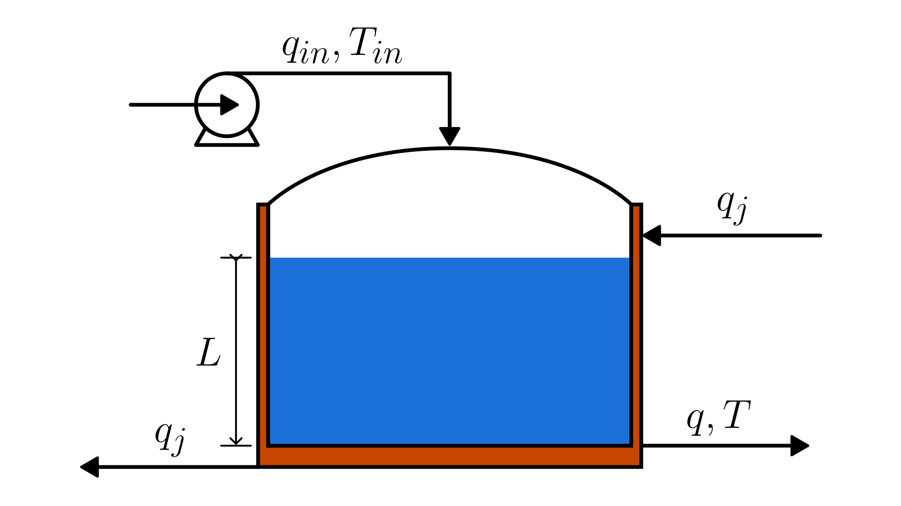

# Heated Tank System

This section describes the dynamic model of a **jacketed tank**.
The system receives liquid through a **pumped inlet stream**, while the outlet flow is **gravity-driven**.
The tank is surrounded by a **heating jacket** into which **saturated steam enters** and from which **saturated liquid condensate leaves**.
The condensation of steam inside the jacket transfers heat to the tank, increasing the temperature of the liquid inside.

The physical system is illustrated in the figure:

The liquid level and temperature dynamics can be mathematically described by the following equations:

$$
\begin{cases}
   \frac{dL}{dt} = \frac{q_{in} - k\sqrt{L}}{A} \\
   \frac{dT}{dt} = \frac{\rho \cdot q_{in} \cdot c_p (T_{in} - T) + \rho_j \cdot q_j \cdot \lambda_j}{\rho \cdot A \cdot L \cdot c_p}
\end{cases}
$$

Where:

- $L$: liquid level inside the tank [m]
- $T$: liquid temperature inside the tank [K]
- $q_{in}$: inlet volumetric flow rate [m³/s]
- $T_{in}$: inlet liquid temperature [K]
- $\rho_j$: density of the condensed liquid leaving the jacket [kg/m³]
- $q_j$: flow rate of the condensate leaving the jacket [m³/s]
- $\lambda_j$: latent heat of condensation of the steam (depends on the steam saturation temperature) [J/kg]
- $A$: tank cross-sectional area [m²]
- $k$: outlet discharge parameter [m $^{2.5}$/s]
- $\rho$: density of the tank liquid [kg/m³]
- $c_p$: specific heat capacity of the tank liquid [J/(kg·K)]

The liquid level is constrained by the physical requirement that it cannot be negative:

$$L(t) \ge 0$$

## Model Assumptions

- The fluid is incompressible, with constant density.
- Gravity-driven outlet follows Torricelli-type behavior
- The inlet flow is assumed known and measurable.

- Kinetic and potential energy are negligible.
- The liquid is a pure substance: the jacket steam enters and leaves at its saturation temperature.
- The specific heat capacity $c_p$ of the tank liquid is constant.
- The tank has a constant cross-sectional area $A$.
- No chemical reactions occur in the tank.
- There are no leaks, evaporation losses, or other unmodeled energy or mass losses.
- The accumulation of mass inside the heating jacket is negligible.
- The jacket steam pressure and temperature remain constant.

## Model Classification

| Property                                 | Classification      |
| ---------------------------------------- | ------------------- |
| Static × Dynamic                         | **Dynamic**         |
| Linear × Nonlinear                       | **Nonlinear**       |
| SISO × SIMO × MISO × MIMO                | **MIMO**            |
| Continuous-time × Discrete-time          | **Continuous-time** |
| Time-invariant × Time-variant            | **Time-invariant**  |
| Lumped-parameters × Distributed-elements | **Lumped**          |
| Deterministic × Stochastic               | **Deterministic**   |
| Forced × Homogeneous                     | **Forced**          |

## Model Derivation

### Mass Balance

Because the tank has a constant cross-sectional area, the standard mass-balance formulation used in the
[Cubic Tank](/models/tank/cubic/README.md) model also applies here.

### Energy Balance

1. Write the [energy balance](/docs/energy-balance.md) of the system:

   $`\frac{dU}{dt} = \rho \cdot q_{in} \cdot h_{in} - \rho \cdot q \cdot h + \dot{Q}`$

   Where:

   - $U$ is the internal energy of the system
   - $h_i$ is the inlet enthalpy
   - $h$ is the outlet enthalpy
   - $\dot{Q}$ represents heat added to the system

   In this case, there are no contributions from kinetic or potential energy, and no shaft work is involved.
   Therefore, the energy balance reduces to a relation between the internal energy accumulation, the enthalpy carried by the inlet and outlet flows, and the heat added to the system.

2. Using the relation between internal energy and enthalpy

   For liquid systems, the internal energy is approximately equal to the enthalpy:

   $`U \approx H`$

   The total enthalpy of the tank is

   $`H = m \cdot h`$

   where $m=\rho \cdot A \cdot L$ is the mass of liquid in the tank.
   Substitute this into the differential energy balance (rate form):

   $`\frac{d\left(\rho \cdot A \cdot L \cdot h\right)}{dt} = \rho \cdot q_{in} \cdot h_{in} - \rho \cdot q \cdot h + \dot{Q}`$

   Since $\rho$ and $A$ are constants, they can be taken outside the derivative:

   $`\rho \cdot A \cdot \frac{d\left(L \cdot h\right)}{dt} = \rho \cdot q_{in} \cdot h_{in} - \rho \cdot q \cdot h + \dot{Q}`$

3. Expanding the derivative

   Apply the product rule to the derivative:

   $`\frac{d(L \cdot h)}{dt} = L\frac{dh}{dt} + h\frac{dL}{dt}.`$

   Using the mass balance:

   $`\rho A\left( L\frac{dh}{dt} + h\cdot\frac{q_{in} - q}{A} \right) = \rho q_{in}h_{in} - \rho qh + \dot{Q}.`$

   simplifying:

   $`\rho A L\frac{dh}{dt} + \rho h(q_{in} - q) = \rho q_{in}h_{in} - \rho qh + \dot{Q}`$

   $`\rho A L\frac{dh}{dt} = \rho q_{in}(h_{in} - h) + \dot{Q}.`$

4. Expressing the enthalpy as a function of temperature

   For an incompressible liquid with constant specific heat capacity, the specific enthalpy can be written as:

   $`h = c_p \cdot T`$ and $`h_{in} = c_p \cdot T_{in}`$.

   Substitute these expressions into the energy balance equation:

   $`\rho A L \frac{d(c_p T)}{dt} = \rho q_{in} c_p (T_{in} - T) + \dot{Q}.`$

   Since $c_p$ is constant, it can be taken outside the derivative:

   $`\rho A L c_p \frac{dT}{dt} = \rho q_{in} c_p (T_{in} - T) + \dot{Q}.`$

5. Expand the heat-input term $\dot{Q}$

   The heat added to the tank comes from steam condensing in the jacket.
   The condensation releases latent heat, so the heat-input rate is

   $\dot{Q} = \rho_j \cdot q_j \cdot \lambda_j$

6. Substitute the expressions and isolate $\frac{dT}{dt}$

   Insert the heat-input expression into the temperature balance equation:

   $\rho \cdot A \cdot L \cdot c_p \cdot \frac{dT}{dt} = \rho \cdot q_{in} \cdot c_p (T_{in} - T) + \rho_j \cdot q_j \cdot \lambda_j$

   Now isolate the temperature derivative:

   $\boxed{
      \frac{dT}{dt} = \frac{\rho \cdot q_{in} \cdot c_p (T_{in} - T) + \rho_j \cdot q_j \cdot \lambda_j}{\rho \cdot A \cdot L \cdot c_p}
   }$
