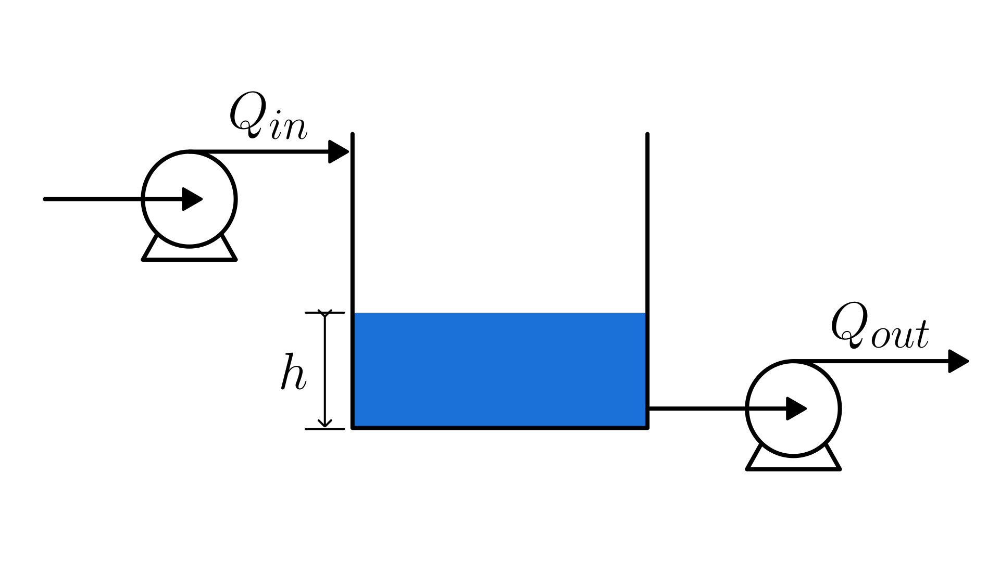

# Cubic Tank with Pumped Inlet and Outlet

> 💡 This model also applies to other tanks with a **constant cross-sectional area**, such as tanks with a rectangular or circular base.
> You just need to replace the numerical value of $A$ with the correct base area.

This section describes the model representing the physical system composed of a **cubic tank** with **pumped inlet and outlet flows**.
The liquid level inside the tank changes according to the balance between the inflow and outflow rates.
The physical system is illustrated in the figure below:

  

The liquid level dynamics can be mathematically described by the following equation:

$$\frac{dh(t)}{dt} = \frac{Q_{in}(t) - Q_{out}(t)}{A}$$

Where:

- $h(t)$: liquid level [m]
- $Q_{in}(t)$: inlet volumetric flow rate [m³/s]
- $Q_{out}(t)$: outlet volumetric flow rate [m³/s]
- $A = L^2$: cross-sectional area of the tank [m²]

Since the tank is cubic, the liquid level is naturally constrained by its physical height:

$$
0 \le h(t) \le L
$$

## Model Assumptions

- The tank has a constant square cross-section with side length $L$.
- The fluid is incompressible, with constant density.
- Both inlet and outlet flows are pumped.
- No chemical reactions, leaks, or evaporation are considered.

## Model Classification

| Property                                 | Classification      |
| ---------------------------------------- | ------------------- |
| Static × Dynamic                         | **Dynamic**         |
| Linear × Nonlinear                       | **Linear**          |
| MISO × MIMO                              | **MISO**            |
| Continuous-time × Discrete-time          | **Continuous-time** |
| Time-invariant × Time-variant            | **Time-invariant**  |
| Lumped-parameters × Distributed-elements | **Lumped**          |
| Deterministic × Stochastic               | **Deterministic**   |

## Model Derivation

We want to model the liquid level $h(t)$ in a cubic tank.
The first step is to write the [mass balance](/docs/mass-balance.md) of the liquid in the tank:

$$
\frac{dM(t)}{dt} = \dot{M}_{in}(t) - \dot{M}_{out}(t)
$$

Where $M(t)$ is the mass of the liquid [kg], and $`\dot{M}_{in}`$, $`\dot{M}_{out}`$ are the mass flow rates [kg/s].

In this case, there are no generation or consumption terms, since the liquid does not undergo any chemical reactions and there are no internal sources or sinks of mass.
Therefore, the balance reduces to a simple relation between the inlet and outlet flows.

Using the physical relation between mass, density, and volume (as well as between mass flow rate and volumetric flow rate), we can write:

$$
M(t) = \rho \, V(t), \quad \dot{M}_{in} = \rho Q_{in}(t), \quad \dot{M}_{out} = \rho Q_{out}(t)
$$

For an **incompressible fluid** with constant density $\rho$, we can take $\rho$ out of the derivative and simplify the equation:

$$
\frac{d}{dt} (\rho V(t)) = \rho Q_{in}(t) - \rho Q_{out}(t) \quad \Rightarrow \quad \frac{dV(t)}{dt} = Q_{in}(t) - Q_{out}(t)
$$

This is the **volumetric balance**.

To relate the liquid volume to its height, we note that the volume is given by the base area multiplied by the height $h(t)$:

$$
V(t) = A \, h(t), \quad \text{with} \quad A = L^2
$$

Substituting into the volumetric balance:

$$
\frac{d}{dt}[A \, h(t)] = Q_{in}(t) - Q_{out}(t)
$$

Since $A$ is constant:

$$
A \frac{dh(t)}{dt} = Q_{in}(t) - Q_{out}(t)
$$

Finally, the **dynamic equation for the liquid level** is:

$$
\boxed{\frac{dh(t)}{dt} = \frac{Q_{in}(t) - Q_{out}(t)}{A}}
$$
