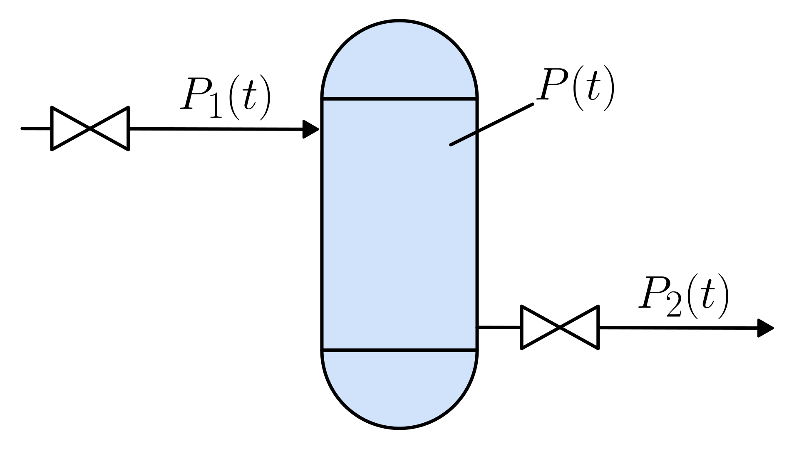

# Pressurized Isothermal Gas Vessel

This section describes a **gas-filled vessel** with **fixed inlet and outlet openings**. The physical system is illustrated in the figure below:

The gas dynamics are governed by the following equation:

$$
\frac{dP}{dt} = \frac{R \cdot T \cdot (k_1 \sqrt{P_1 - P} - k_2 \sqrt{P - P_2})}{V \cdot \mathrm{MM}}
$$

Where:

- $P$: gas pressure inside the vessel [Pa]
- $P_1$: upstream (inlet) pressure [Pa]
- $P_2$: downstream (outlet) pressure [Pa]
- $V$: vessel volume [m³]
- $MM$: molar mass of the gas [kg/mol]
- $R$: universal gas constant [J/(mol·K)]
- $T$: gas temperature [K]
- $k_1$: flow coefficient for the inlet [kg/(s·Pa $^{1/2}$)]
- $k_2$: flow coefficient for the outlet [kg/(s·Pa $^{1/2}$)]

## Model Assumptions

- The fluid is in the gas phase.
- The inlet and outlet openings are fixed.
- The gas behaves as an ideal gas.
- The temperature ($T$) is constant (isothermal conditions).
- No chemical reactions, phase change, or leaks are considered.
- Spatial variations inside the vessel are neglected.

## Model Classification

| Property                                 | Classification      |
| ---------------------------------------- | ------------------- |
| Static × Dynamic                         | **Dynamic**         |
| Linear × Nonlinear                       | **Nonlinear**       |
| SISO × SIMO × MISO × MIMO                | **MISO**            |
| Continuous-time × Discrete-time          | **Continuous-time** |
| Time-invariant × Time-variant            | **Time-invariant**  |
| Lumped-parameters × Distributed-elements | **Lumped**          |
| Deterministic × Stochastic               | **Deterministic**   |

## Model Derivation

We want to model the pressure $P(t)$ inside a pressurized gas vessel.
The derivation follows from the [mass balance](/docs/mass-balance.md) principle.

1. **Mass balance of the vessel**

   $`\frac{dm(t)}{dt} = F_{1}(t) - F_{2}(t)`$

   where $m(t)$ is the gas mass inside the vessel [kg], and $F_{1}(t)$, $F_{2}(t)$ are the inlet and outlet mass flow rates [kg/s].

2. **Flow model through fixed openings**

   Each mass flow is assumed proportional to the square root of the driving pressure difference:

   $`
   F_{in}(t) = k_1 \sqrt{P_1 - P(t)}, \quad
   F_{out}(t) = k_2 \sqrt{P(t) - P_2}
   `$

   Substituting into the mass balance:

   $`
   \frac{dm(t)}{dt} = k_1 \sqrt{P_1 - P(t)} - k_2 \sqrt{P(t) - P_2}
   `$

3. **Ideal Gas Law**

   For an ideal gas, the pressure, volume, and temperature are related by the [ideal gas law](/docs/ideal-gas-law.md):

   $`
   P V = n R T
   `$

   The amount of substance $n$ is defined as:

   $`
   n = \frac{m}{MM}
   `$

   where $m$ is the gas mass [kg] and $MM$ is the molar mass [kg/mol].
   Substituting into the ideal gas law gives:

   $`
   m(t) = \frac{P(t)\,V\,MM}{R T}
   `$

4. **Differentiating the gas mass**

   Taking the derivative:

   $`
   \frac{dm(t)}{dt} = \frac{V \, MM}{R T} \frac{dP(t)}{dt}
   `$

   since $V$, $MM$, $R$, and $T$ are constants (the system is isothermal).

5. **Final dynamic equation**

   Equating the two expressions for $\tfrac{dm(t)}{dt}$:

   $`
   \frac{V \, MM}{R T} \frac{dP(t)}{dt} = k_1 \sqrt{P_1 - P(t)} - k_2 \sqrt{P(t) - P_2}
   `$

   Rearranging:

   $`
   \boxed{\frac{dP}{dt} = \frac{R \cdot T \cdot (k_1 \sqrt{P_1 - P} - k_2 \sqrt{P - P_2})}{V \cdot \mathrm{MM}}}
   `$

   This is the governing differential equation for the vessel pressure dynamics.
